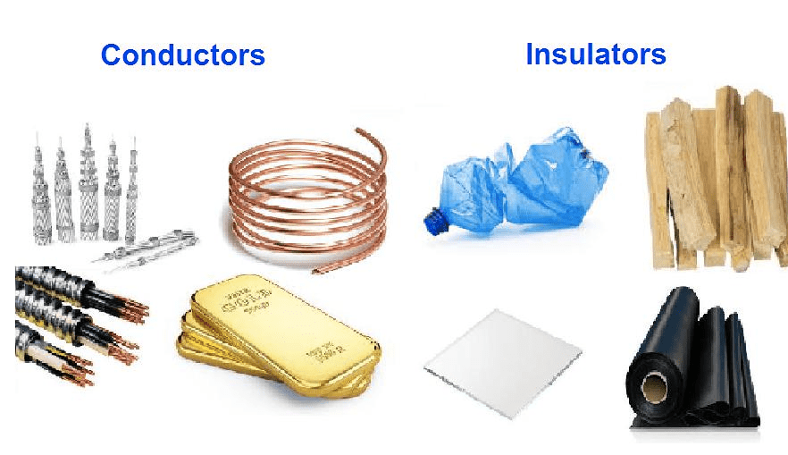
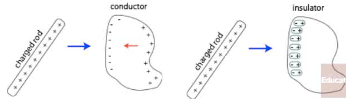
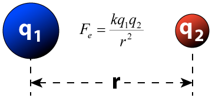

# Conductors and Insulators

 

  -  Resistivity is a material property, measured in (Ω·m)

# Charging by Conduction

 

# The Electroscope

  -  An electroscope is used to detect small electric charges based on
     conduction

 

# Charging by Induction

 
 
 

# Polarization and Electric Dipole Moment

  -  When a charged object is brought near a conductor, the electrons
     in the conductor are free to move

  -  When a charged object is brought near an insulator, the electrons
     are not free to move, bu they may spend a little more time on the
     side of their orbit than another, creating a net separation of
     charge in a process known as **polarization**

  -  The distance between the shifted positive and negative charges,
     multiplied by the charge, is known as the **electric dipole
     moment**

 
 
 

# Coulomb's law

 
 
 

# Practice Question 1

# Practice Question 2

