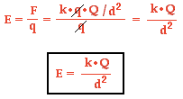
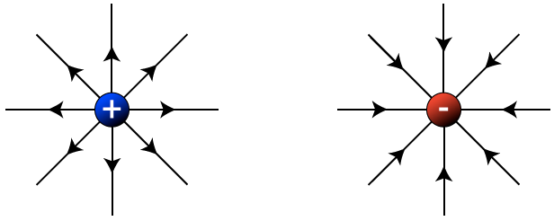
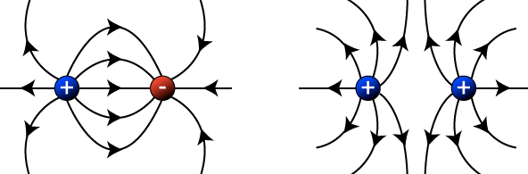
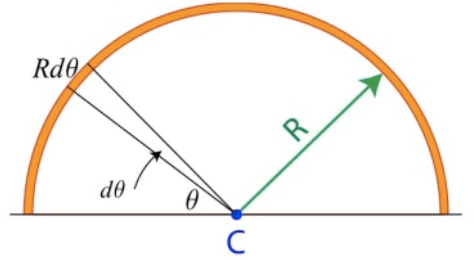
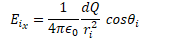
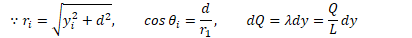
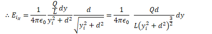
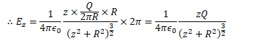
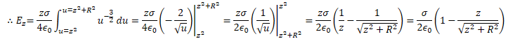

# Electric Fields

  -  

 
 
 

# Visualizing the Electric Fields

 
 
 

# Comparing Electrostatics & Gravity

  -  Gravity only attracts

  -  Electrostatics attract and repel

 

# Charge Densities

 

# Practice Question 1

 

# Practice Question 2

 

# Practice Question 3

 

  -  

  -  

  -  

  -  

  -  

 

# Practice Question 4

 

  -  Find the electric field a distance d from a long straight
     insulating rod of length L at point P perpendicular to the wire
     and eduidistant from each end of the wire if the wire is uniformly
     charged
    
      -  
    
      -  
    
      -  
    
      -  

  -  What if the line is infinitely
         long
    
      -  
    
      -  
    
      -  

  -  What is the E field if the distance d is
         infinite?
    
      -  

# Practice Question 4

 

  -  

  -  

  -  

  -  

  -  

  -  

# Practice Question 5

 

  -  

  -  

  -  

  -  

  -  

  -  

  -  

  -  

  -  

  -  

# Practice Question 6

 

  -  

  -  

  -  

  -  

  -  

  -  