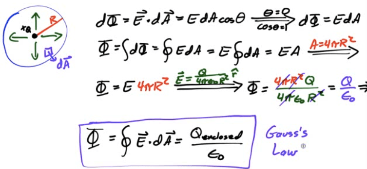
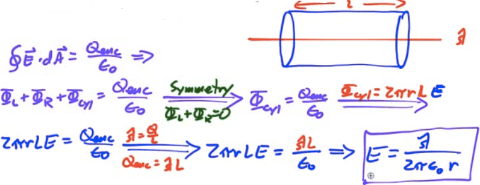
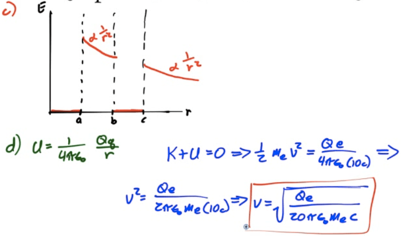
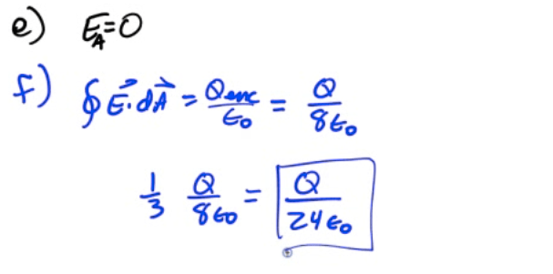

# Electric Flux

  -  Electric Flux is the amount of electric field penetrating a
     surface

 
 
 

# Point Charge Inside a Hollow Sphere

  -  Place a point charge inside a hollow sphere of radius R.

  -  Determine the flux through the
 sphere

 

# Gauss's Law

  -  Useful for finding the electric field due to charge distributions
     for cases of:
    
      -  Spherical Symmetry
    
      -  Cylindrical Symmetry
    
      -  Planar Symmetry

 ![Gauss's Law for Electric Fields from Fleisch Reminder that the
 electric field is a vector Reminder that this integral is over a
 closed surface Dot product tells you to find the part of E parallel to
 h (perpendicular to the surface) The unit vector normal to the surface
 Electric Flux Tells you to sum up the The electric field in N/C An
 increment of surface area in m2 The amount of net charge in coulombs
 Reminder that only the enclosed charge contributes The electric
 permittivity of the free space contributions from each Reminder that
 this is a surface portion of the surface integral (not a volume or a
 line integral) The flux of an electric field passing through any
 closed surface is proportional to the total charge contained within
 that surface. ](./media/image65.png)

# Practice Question 1

  -  Find the electric field inside and outside a thin hollow shell of
     uniformly distributed charge
 Q

 

# Practice Question 2

  -  Find the electric field E to an infinite plane of uniform charge
     density σ.

 

# Practice Question 3

  -  Find the electric field outside and between two oppositely-charged
     parallel planes or
 plates

 

# Practice Question 4

  -  Find the electric field strength at a distance R from an
     infinitely long uniformly charged wire of linear charge density λ

 

# 2008 Free Response Question 1

 ![a c A metal sphere of radius a contains a charge +Q and is
 surrounded by an uncharged, concentric, metallic shell of inner radius
 b and outer radius c, as shown above. Express all algebraic answers in
 terms of the given quantities and fundamental constants. (a) Determine
 the induced charge on each of the following and explain your reasoning
 in each case. i. The inner surface of the metallic shell ii. The outer
 surface of the metallic shell (b) Determine expressions for the
 magnitude of the electric field E as a function of r, the distance
 from the center of the inner sphere, in each of the following regions.
 i. ii. iii. iv. ](./media/image70.png)
 
 
 
  
 
 
 
 
 
 

# 2011 Free Response Question 1

 ![A nonconducting, thin, spherical shell has a uniform surface charge
 density on its outside surface and no charge anywhere else inside. (a)
 Use Gauss's law to prove that the electric field inside the shell is
 zero everywhere. Describe the Gaussian surface that you use. (b) The
 charges are now redistributed so that the surface charge density is no
 longer uniform. Is the electric field still zero everywhere inside the
 shell? Yes No It cannot be determined from the information given.
 Justify your answer. Now consider a small conducting sphere with
 charge +Q whose center is at corner A of a cubical surface, as shown
 below. (c) For which faces of the surface, if any, is the electric
 flux through that face equal to zero? ABCD CDEF EFGH ABGH BCFG ADEH
 Explain your reasoning. (d) At which corner(s) of the surface does the
 electric field have the least magnitude? (e) Determine the electric
 field strength at the position(s) you have indicated in part (d) in
 terms of Q, L, and fundamental constants, as appropriate. (f) Given
 that one-eighth of the sphere at point A is inside the surface,
 calculate the electric flux through face CDEF. ](./media/image75.png)
 
 
 
 
