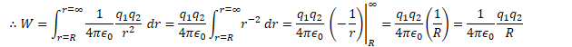
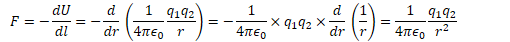
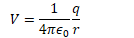

# Electric Potential Energy

  -  When an object was lifted against gravity by applying a force for
     some distance, work was done to give that object gravitational
     potential energy

  -  When a charged object is moved against an electric field by
     applying a force for some distance, work is done to give that
     object electric potential energy.

  -  The work done per unit charge in moving a charge between two
     points in an electric field is a scalar known as the electric
     potential V (or voltage)
    
      -  Units: volts (1V = 1 J/C)
    
      -  The work done is equal to the change in the object's electric
         potential energy
         (UE)
    
      -  

 

# The Electron-Volt

  -  Oftentimes the electrical energy and/or work done is a very small
     portion of a joule

  -  A smaller, alternative, non-standard unit of energy is often used
     for convenience, known as the electron volt (eV)
    
      -  1 eV is the amount of work done in moving an elementary charge
         through a potential difference of 1
         volt
    
      -  

# Equipotential Lines

  -  Topographic maps show you lines of equal altitude, or equal
     gravitational potential

  -  Lines connecting points of equal electrical potential are known as
     equipotential lines.
    
      -  Equipotential lines always cross electrical field lines at
         right angles
    
      -  If you move a charged particle in space, and stay on an
         equipotential line, no work will be done.
    
      -  As equipotential lines get closer together, the gradients of
         the potential increases (stepper "slope" of potentials)
    
      -  Electric field points from high to low potential

 

# Electric Potential Energy Due to a Point Charge

  -  

 

  -  

  -  

  -  

# Electric Force from Electric Potential Energy

  -  

# Electric Potential Due to a Point Charge

  -  Electric potential (voltage) is the work per unit charge required
     to bring a charge from infinity to some point R in an electric
     field

  -  

  -  

# Example 1: Electric Potential Due to a Point Charge 

  -  Find the electric potential at point P, located 3 meters away from
     a -2 C charge.

  -  What is the electric potential energy of a 0.5 C charge situated
     at point P?

 

# Example 2: Electric Potential Due to a Point Charge

  -  Find the electric potential at the origin due to the three charges
     shown in the diagram. If an electron is placed at the origin, what
     potential energy does it possess?

 

# Finding Electric Field from Electric Potential

  -  

  -  

  -  

# Finding Electric Potential from Electric Field

  -  

  -  

  -  

 

# Example 3: Electric Potential Due to a Point Charges

 
 
 

# Example 4: Electric Field from Potential

 

# Example 5: Speed of an Electron Released in an Electric Field

 

# Example 6: Work Required to Establish a Charge System

 
 
 

# 2013 Free Response Question 1

 ![Axis.-- - A very long, solid, nonconducting cylinder of radius R has
 a positive charge of uniform volume density p . A section of the
 cylinder far from its ends is shown in the diagram above. Let r
 represent the radial distance from the axis of the cylinder. Express
 all answers in terms of r, R, p , and fundamental constants, as
 appropriate. (a) Using Gauss's law, derive an expression for the
 magnitude of the electric field ata radius r < R. Draw an appropriate
 Gaussian surface on the diagram. (b) Using Gauss's law, derive an
 expression for the magnitude of the electric field at a radius r > R.
 (c) On the axes below, sketch the graph of electric field E as a
 function of radial distance r for r = 0 to r = 2R. Explicitly label
 any intercepts, asymptotes, maxima, or minima with numerical values or
 algebraic expressions, as appropnate. (d) 2R i. Derive an expression
 for the magnitude of the potential difference between r ii. Is the
 potential higher at r = 0 or r = R ? O and r = R.
 ](./media/image105.png)
 
 
 
 
 
 
 
 

# 2006 Free Response Question 1

 ![-Q R -Q -Q The square of side a above contains a positive point
 charge +Q fixed at the lower left corner and negative point charges —Q
 fixed at the other three corners of the square. Point P is located at
 the center of the square. (a) On the diagram, indicate with an arrow
 the direction of the net electric field at point P. (b) Derive
 expressions for each of the following in terms of the given quantities
 and fundamental constants. i. The magnitude of the electric field at
 point P ii. The electric potential at point P (c) A positive charge is
 placed at point P. It is then moved from point P to point R, which is
 at the midpoint of the bottom side of the square. As the charge is
 moved, is the work done on it by the electric field positive,
 negative, or zero? Positive Explain your reasoning. (d) Negative Zero
 i. Describe one way to replace a single charge in this configuration
 that would make the electric field at the center of the square equal
 to zero. Justify your answer. ii. Describe one way to replace a single
 charge in this configuration such that the electric potential at the
 center of the square is zero but the electric field is not zero.
 Justify your answer.
 ](./media/image110.png)
 
 
 
 

# 2005 Free Response Question 1

 ![0.1 0.08 0.06 - 0.04 - 0.02 - 0.02 Consider the electric field
 diagram above. 0.04 0.06 0.08 0.1 (a) Points A, B, and C are all
 located at y = 0.06 m . i. At which of these three points is the
 magnitude of the electric field the greatest? Justify your answer. ii.
 At which of these three points is the electric potential the greatest?
 Justify your answer. (b) An electron is released from rest at point B.
 i. Qualitatively describe the electron's motion in terms of direction,
 speed, and acceleration. ii. Calculate the electron's speed after it
 has moved through a potential difference of 10 V. (c) Points B and C
 are separated by a potential difference of 20 V. Estimate the
 magnitude of the electric field midway between them and state any
 assumptions that you make. (d) On the diagram, draw an equipotential
 line that passes through point D and intersects at least three
 electric field lines. ](./media/image113.png)
 
 
 
 

# 2003 Free Response Question 1

 ![A spherical cloud of charge of radius R contains a total charge +Q
 with a nonuniform volume charge density that varies according to the
 equation p(r) = PO(I for r R and p = O for r > R, where r is the
 distance from the center of the cloud. Express all algebraic answers
 in terms of Q, R, and fundamental constants. (a) (b) (c) (d) (e)
 Determine the following as a function of r for r > R. i. The
 magnitude E of the electric field ii. The electric potential V A
 proton is placed at point P shown above and released. Describe its
 motion for a long time after its release. An electron of charge
 magnitude e is now placed at point P, which is a distance r from the
 center of the sphere, and released. Determine the kinetic energy of
 the electron as a function of r as it strikes the cloud. Derive an
 expression for po . Determine the magnitude E of the electric field as
 a function of r for r R . ](./media/image116.png)
 
 
 
 
 
 
