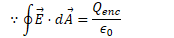
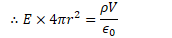
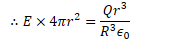

# Potential Due to a Charged Ring

 

  -  Find the electric potential on the axis of a uniformly charged
     ring of radius R and total charge Q at point P located a distance
     z from the center of the
     ring

  -  

  -  

  -  

# Potential Due to a Charged Disk

 

  -  Find the electric potential on the axis of a uniformly charged
     disk of radius R and total charge Q at point P located a distance
     z from the center of the
 ring

 
 
 
 
 
 
 
 
 

# Potential Due to a Spherical Shell of Charge

 

  -  Find the electric potential both inside and outside a uniformly
     charged shell of radius R and total charge
     Q

  -  

  -  

 

# Potential Due to a Uniform Solid Sphere

 

  -  Find the electric field and electric potential inside a uniformly
     charged solid insulating sphere of radius R and total charge
     Q

  -  

  -  

  -  

  -  

  -  

  -  

# 2012 Free Response Question 1

 ![0.20 m 0.10 m -100 v +100 V Two thin, concentric, conducting
 spherical shells, insulated from each other, have radii of 0.10 m and
 0.20 m, as shown above. The inner shell is set at an electric
 potential of —100 V , and the outer shell is set at an electric
 potential of +100 V, with each potential defined relative to the
 conventional reference point. Let Q and Q represent the net charge on
 the inner and outer shells, respectively, and let r be the radial
 distance from the center of the shells. Express all algebraic answers
 in terms of Q, Qo , r, and fundamental constants, as appropriate. (a)
 Using Gauss's Law, derive an algebraic expression for the electric
 field E(r) for 0.10 m < r < 0.20 m . (b) Determine an algebraic
 expression for the electric field E(r) for r > 0.20 m . (c) Determine
 an algebraic expression for the electric potential V(r) for r > 0.20
 m . (d) Using the numerical information given, calculate the value of
 the total charge QT on the two spherical shells (QT =Q+QO).
 ](./media/image141.png)
 
 
 
 
 
 
 
 

# 2010 Free Response Question 1

 ![+Q E\&M. 1. Figure I A charge +Q is uniformly distributed over a
 quarter circle of radius R, as shown above. Points A, B, and C are
 located as shown, with A and C located symmetrically relative to the
 x-axis. Express all algebraic answers in terms of the given quantities
 and fundamental constants. (a) Rank the magnitude of the electric
 potential at points A, B, and C from greatest to least, with number 1
 being greatest. If two points have the same potential, give them the
 same ranking. Justify your rankings. Point P is at the origin, as
 shown below, and is the center of curvature of the charge
 distribution. +Q Figure Il ](./media/image146.png)
 
 
 
 
 
 

# 2009 Free Response Question 1

 ![A spherically symmetric charge distribution has net positive charge
 Q) distributed within a radius of R. Its electric potential V as a
 function of the distance r from the center of the sphere is given by
 the following. V(r) = 2 -2+3 for r < R 41t€0R V(r) = for r > R
 41t€or Express all algebraic answers in terms of the given
 quantities and fundamental constants. (a) For the following regions,
 indicate the direction of the electric field E(r) and derive an
 expression for its magnitude. Radially inward ii. r > R Radially
 inward Radially outward Radially outward (b) For the following
 regions, derive an expression for the enclosed charge that generates
 the electric field in that region, expressed as a function of r. ii. r
 > R (c) Is there any charge on the surface of the sphere (r = R) ?
 Yes No If there is, determine the charge. In either case, explain your
 reasoning. ](./media/image150.png)
 
 
 
 
 
 
 
 

# 2007 Free Response Question 2 

 ![-Q In the figure above, a nonconducting solid sphere of radius a
 with charge +Q uniformly distributed throughout its volume is
 concentric with a nonconducting spherical shell of inner radius 2a and
 outer radius 3a that has a charge —Q uniformly distributed throughout
 its volume. Express all answers in terms of the given quantities and
 fundamental constants. (a) Using Gauss's law, derive expressions for
 the magnitude of the electric field as a function of radius rin the
 following regions. i. Within the solid sphere (r < a) ii. Between the
 solid sphere and the spherical shell (a < r < 2a) iii. Within the
 spherical shell (2a < r < 3a ) iv. Outside the spherical shell (r >
 3a) (b) What is the electric potential at the outer surface of the
 spherical shell ( r = 3a )? Explain your reasoning. (c) Derive an
 expression for the electric potential difference Vx — VY between
 points X and Y shown in the figure. ](./media/image155.png)
 
 
 
 
 
 