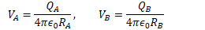
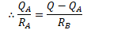
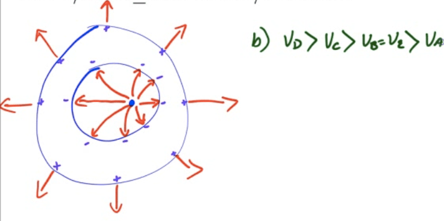

# Charges in a Conductor

  -  Charge is free to move until the E=0

 

  -  All charge resides at surface

 

  -  Field lines are perpendicular to the surface

 

# Electric Field at the Surface of a Conductor

  -  

  -  

  -  

  -  

  -  E increases as r σ increases.

# Hollow Conductors

 
 
 

# Example 1: Conducting Spheres Connected by a Wire

 

  -  Two conducting spheres, A and B, are placed a large distance from
     each other. The radius of Sphere A is 5 cm, and the radius of
     Sphere B is 20 cm. A charge Q of 200 nC is placed on Sphere A,
     while Sphere B is uncharged. The spheres are then connected by a
     wire. Calculate the charge on each sphere after the wire is
     connected

  -  

  -  

  -  

  -  

  -  

  -  

# 2004 Free Response Question

 ![Conductor E\&M. 1. r2 111 11 1 0+1 •d •a Conductor Cross Section The
 figure above left shows a hollow, infinite, cylindrical, uncharged
 conducting shell of inner radius rl and outer radius r2 . An infinite
 line charge of linear charge density +1 is parallel to its axis but
 off center. An enlarged cross section of the cylindrical shell is
 shown above right. (a) On the cross section above right, i. sketch the
 electric field lines, if any, in each of regions I, Il, and Ill and
 ii. use + and — signs to indicate any charge induced on the conductor.
 (b) In the spaces below, rank the electric potentials at points a, b,
 c, d, and e from highest to lowest (1 = highest potential). If two
 points are at the same potential, give them the same number.
 ](./media/image175.png)
 
 
 
 ![Nonconductor Nonconductor Cross Section (c) The shell is replaced by
 another cylindrical shell that has the same dimensions but is
 nonconducting and carries a uniform volume charge density +P . The
 infinite line charge, still of charge density +1 , is located at the
 center of the shell as shown above. Using Gauss's law, calculate the
 magnitude of the electric field as a function of the distance r from
 the center of the shell for each of the following regions. Express
 your answers in terms of the given quantities and fundamental
 constants.
 ](./media/image177.png)
 
 