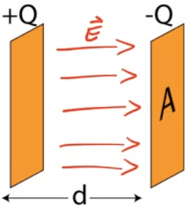
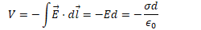
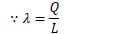
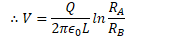
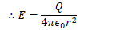
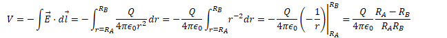
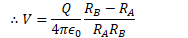
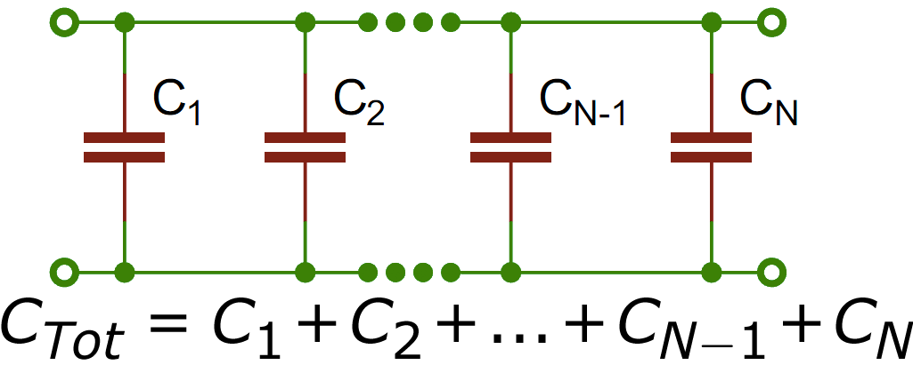

# What is a Capacitor?

  -  A capacitor is an electric device used to store electrical energy
    
      -  Two conducting plates
    
      -  Insulating material between (dielectric)

  -  Place opposite charges on each plate

  -  Develop a potential difference across the plates

  -  Energy is stored in the electric field between the plates

 

# Capacitance

  -  Capacitance (C) is the ratio of the charge separated on the plates
     of a capacitor to the potential difference between the plates

  -  Units of capacitance are coulombs/volt, or farads (F)
    
      -  A farad is a very large amount of capacitance

 

# Calculating Capacitance

1.   Assume a charge of +Q and -Q on each conductor

2.   Find the electric field between the conductors (Gauss's
     Law)

3.   

4.   

# Example 1: Parallel Plates

 

  -  Determine the capacitance between identical parallel plates of
     area A separated by a distance d

<!-- end list -->

1.   Assume +Q and
     -Q

2.   

3.   

 
 
 

1.   

# Example 2: Cylindrical Capacitor

  -  

<!-- end list -->

1.   Assume +Q and
     -Q

<!-- end list -->

1.   

 
 
 

1.   

 
 
 

1.   

# Example 3: Spherical Capacitor

 

  -  

<!-- end list -->

1.   Assume +Q and
     -Q

<!-- end list -->

1.   

 
 
 

1.   

 
 
 

1.   

# Energy Stored in a Capacitor

  -  Work is done charging a capacitor, allowing the capacitor to store
     energy.

  -  

  -  

  -  

  -  

  -  

 

# Field Energy Density

  -  

  -  

 

# Dielectrics

  -  Insulating Materials

 
 
 
 
  

# Dielectric Constant (κ)

 
 
 

# Example 4: Capacitors in Series

 

  -  Determine the equivalent capacitance of two capacitors in
     series

  -  

  -  

 

# Example 5: Capacitors in Parallel

 

  -  Determine the equivalent capacitance of two capacitors in
     parallel

  -  

 

# Example 6: Capacitance

  -  A capacitor stores 3 microcoulombs of charge with a potential
     difference of 1.5 volts across the plates. What is its
     capacitance? How much energy is stored in the
     capacitor?

  -  

  -  

# Example 7: Charge on a Capacitor

 

# Example 8: Designing a Capacitor

 

# Example 9: Calculating Capacitance

 

# Example 10: Two Conducting Spheres

 

# Example 11: Inserting a Dielectric

 