1.1 - Electric Charge & Coulomb's Law

Tuesday, February 28, 2017

9:25 AM

 

# Conductors and Insulators

> 

  - > Resistivity is a material property, measured in (Ω·m)

# Charging by Conduction

> 

# The Electroscope

  - > An electroscope is used to detect small electric charges based on
    > conduction

> 

# Charging by Induction

> 
> 
> 

# Polarization and Electric Dipole Moment

  - > When a charged object is brought near a conductor, the electrons
    > in the conductor are free to move

  - > When a charged object is brought near an insulator, the electrons
    > are not free to move, bu they may spend a little more time on the
    > side of their orbit than another, creating a net separation of
    > charge in a process known as **polarization**

  - > The distance between the shifted positive and negative charges,
    > multiplied by the charge, is known as the **electric dipole
    > moment**

> 
> 
> 

# Coulomb's law

> 
> 
> 

# Practice Question 1

# Practice Question 2

 

 

1.2 - Electric Fields

Tuesday, February 28, 2017

9:57
    > AM

 

# Electric Fields

  - > 

> 
> 
> 

# Visualizing the Electric Fields

> 
> 
> 

# Comparing Electrostatics & Gravity

  - > Gravity only attracts

  - > Electrostatics attract and repel

> 

# Charge Densities

> 

# Practice Question 1

> 

# Practice Question 2

> 

# Practice Question 3

> 

  - > 

  - > 

  - > 

  - > 

  - > 

> 

# Practice Question 4

> 

  - > Find the electric field a distance d from a long straight
    > insulating rod of length L at point P perpendicular to the wire
    > and eduidistant from each end of the wire if the wire is uniformly
    > charged
    
      - > 
    
      - > 
    
      - > 
    
      - > 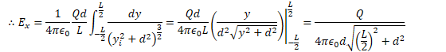

  - > What if the line is infinitely
        > long
    
      - > 
    
      - > 
    
      - > 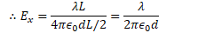

  - > What is the E field if the distance d is
        > infinite?
    
      - > 

# Practice Question 4

> 

  - > 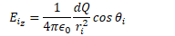

  - > 

  - > 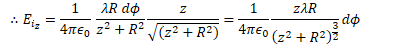

  - > 

  - > 

  - > 

# Practice Question 5

> 

  - > 

  - > 

  - > 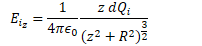

  - > 

  - > 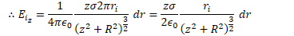

  - > 

  - > 

  - > 

  - > 

  - > 

# Practice Question 6

> 

  - > 

  - > 

  - > 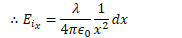

  - > 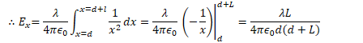

  - > 

  - > 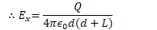

 

 

1.3 - Gauss's Law

Tuesday, February 28, 2017

3:54 PM

 

# Electric Flux

  - > Electric Flux is the amount of electric field penetrating a
    > surface

> 
> 
> 

# Point Charge Inside a Hollow Sphere

  - > Place a point charge inside a hollow sphere of radius R.

  - > Determine the flux through the
> sphere

> 

# Gauss's Law

  - > Useful for finding the electric field due to charge distributions
    > for cases of:
    
      - > Spherical Symmetry
    
      - > Cylindrical Symmetry
    
      - > Planar Symmetry

> ![Gauss's Law for Electric Fields from Fleisch Reminder that the
> electric field is a vector Reminder that this integral is over a
> closed surface Dot product tells you to find the part of E parallel to
> h (perpendicular to the surface) The unit vector normal to the surface
> Electric Flux Tells you to sum up the The electric field in N/C An
> increment of surface area in m2 The amount of net charge in coulombs
> Reminder that only the enclosed charge contributes The electric
> permittivity of the free space contributions from each Reminder that
> this is a surface portion of the surface integral (not a volume or a
> line integral) The flux of an electric field passing through any
> closed surface is proportional to the total charge contained within
> that surface. ](./media/image65.png)

# Practice Question 1

  - > Find the electric field inside and outside a thin hollow shell of
    > uniformly distributed charge
> Q

> 

# Practice Question 2

  - > Find the electric field E to an infinite plane of uniform charge
    > density σ.

> 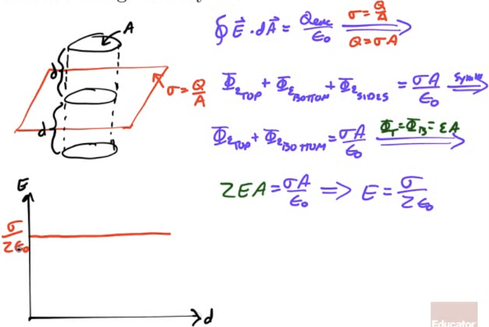

# Practice Question 3

  - > Find the electric field outside and between two oppositely-charged
    > parallel planes or
> plates

> 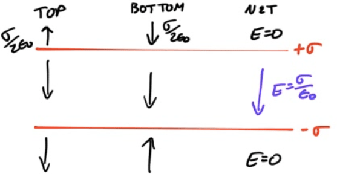

# Practice Question 4

  - > Find the electric field strength at a distance R from an
    > infinitely long uniformly charged wire of linear charge density λ

> 

# 2008 Free Response Question 1

> ![a c A metal sphere of radius a contains a charge +Q and is
> surrounded by an uncharged, concentric, metallic shell of inner radius
> b and outer radius c, as shown above. Express all algebraic answers in
> terms of the given quantities and fundamental constants. (a) Determine
> the induced charge on each of the following and explain your reasoning
> in each case. i. The inner surface of the metallic shell ii. The outer
> surface of the metallic shell (b) Determine expressions for the
> magnitude of the electric field E as a function of r, the distance
> from the center of the inner sphere, in each of the following regions.
> i. ii. iii. iv. ](./media/image70.png)
> 
> 
> 
>  
> 
> 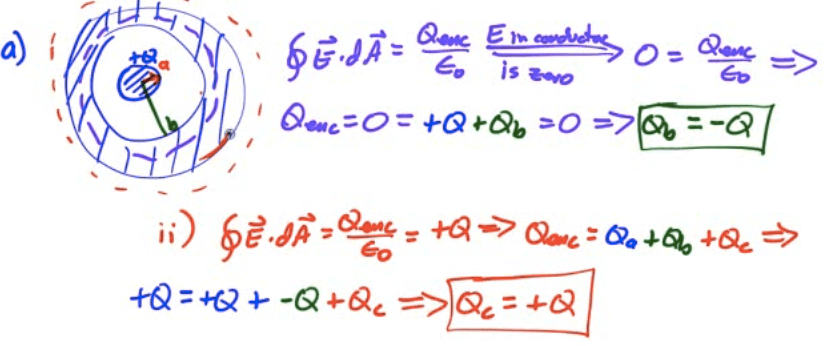
> 
> 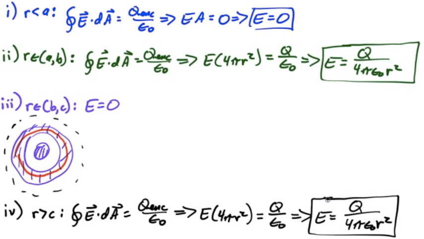
> 
> 

# 2011 Free Response Question 1

> ![A nonconducting, thin, spherical shell has a uniform surface charge
> density on its outside surface and no charge anywhere else inside. (a)
> Use Gauss's law to prove that the electric field inside the shell is
> zero everywhere. Describe the Gaussian surface that you use. (b) The
> charges are now redistributed so that the surface charge density is no
> longer uniform. Is the electric field still zero everywhere inside the
> shell? Yes No It cannot be determined from the information given.
> Justify your answer. Now consider a small conducting sphere with
> charge +Q whose center is at corner A of a cubical surface, as shown
> below. (c) For which faces of the surface, if any, is the electric
> flux through that face equal to zero? ABCD CDEF EFGH ABGH BCFG ADEH
> Explain your reasoning. (d) At which corner(s) of the surface does the
> electric field have the least magnitude? (e) Determine the electric
> field strength at the position(s) you have indicated in part (d) in
> terms of Q, L, and fundamental constants, as appropriate. (f) Given
> that one-eighth of the sphere at point A is inside the surface,
> calculate the electric flux through face CDEF. ](./media/image75.png)
> 
> 
> 
> 

 

 

1.4 - Electric Potential & Electric Potential Energy

Tuesday, February 28, 2017

4:53 PM

 

# Electric Potential Energy

  - > When an object was lifted against gravity by applying a force for
    > some distance, work was done to give that object gravitational
    > potential energy

  - > When a charged object is moved against an electric field by
    > applying a force for some distance, work is done to give that
    > object electric potential energy.

  - > The work done per unit charge in moving a charge between two
    > points in an electric field is a scalar known as the electric
    > potential V (or voltage)
    
      - > Units: volts (1V = 1 J/C)
    
      - > The work done is equal to the change in the object's electric
        > potential energy
        > (UE)
    
      - > 

> 

# The Electron-Volt

  - > Oftentimes the electrical energy and/or work done is a very small
    > portion of a joule

  - > A smaller, alternative, non-standard unit of energy is often used
    > for convenience, known as the electron volt (eV)
    
      - > 1 eV is the amount of work done in moving an elementary charge
        > through a potential difference of 1
        > volt
    
      - > 

# Equipotential Lines

  - > Topographic maps show you lines of equal altitude, or equal
    > gravitational potential

  - > Lines connecting points of equal electrical potential are known as
    > equipotential lines.
    
      - > Equipotential lines always cross electrical field lines at
        > right angles
    
      - > If you move a charged particle in space, and stay on an
        > equipotential line, no work will be done.
    
      - > As equipotential lines get closer together, the gradients of
        > the potential increases (stepper "slope" of potentials)
    
      - > Electric field points from high to low potential

> 

# Electric Potential Energy Due to a Point Charge

  - > 

> 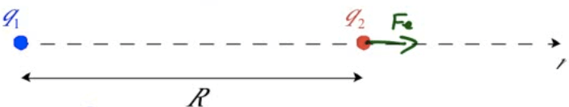

  - > 

  - > 

  - > 

# Electric Force from Electric Potential Energy

  - > 

# Electric Potential Due to a Point Charge

  - > Electric potential (voltage) is the work per unit charge required
    > to bring a charge from infinity to some point R in an electric
    > field

  - > 

  - > 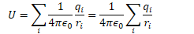

# Example 1: Electric Potential Due to a Point Charge 

  - > Find the electric potential at point P, located 3 meters away from
    > a -2 C charge.

  - > What is the electric potential energy of a 0.5 C charge situated
    > at point P?

> 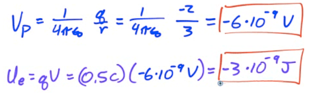

# Example 2: Electric Potential Due to a Point Charge

  - > Find the electric potential at the origin due to the three charges
    > shown in the diagram. If an electron is placed at the origin, what
    > potential energy does it possess?

> 

# Finding Electric Field from Electric Potential

  - > 

  - > 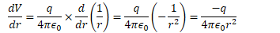

  - > 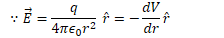

# Finding Electric Potential from Electric Field

  - > 

  - > 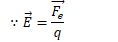

  - > 

> 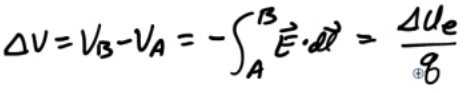

# Example 3: Electric Potential Due to a Point Charges

> 
> 
> 

# Example 4: Electric Field from Potential

> 

# Example 5: Speed of an Electron Released in an Electric Field

> 

# Example 6: Work Required to Establish a Charge System

> 
> 
> 

# 2013 Free Response Question 1

> ![Axis.-- - A very long, solid, nonconducting cylinder of radius R has
> a positive charge of uniform volume density p . A section of the
> cylinder far from its ends is shown in the diagram above. Let r
> represent the radial distance from the axis of the cylinder. Express
> all answers in terms of r, R, p , and fundamental constants, as
> appropriate. (a) Using Gauss's law, derive an expression for the
> magnitude of the electric field ata radius r \< R. Draw an appropriate
> Gaussian surface on the diagram. (b) Using Gauss's law, derive an
> expression for the magnitude of the electric field at a radius r \> R.
> (c) On the axes below, sketch the graph of electric field E as a
> function of radial distance r for r = 0 to r = 2R. Explicitly label
> any intercepts, asymptotes, maxima, or minima with numerical values or
> algebraic expressions, as appropnate. (d) 2R i. Derive an expression
> for the magnitude of the potential difference between r ii. Is the
> potential higher at r = 0 or r = R ? O and r = R.
> ](./media/image105.png)
> 
> 
> 
> 
> 
> 
> 
> 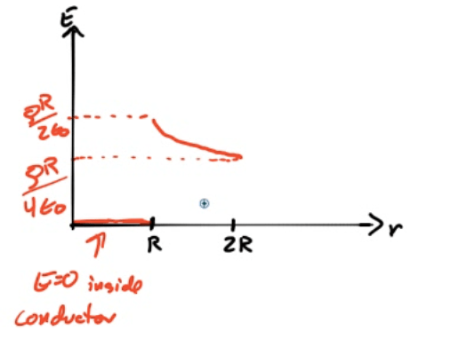

# 2006 Free Response Question 1

> ![-Q R -Q -Q The square of side a above contains a positive point
> charge +Q fixed at the lower left corner and negative point charges —Q
> fixed at the other three corners of the square. Point P is located at
> the center of the square. (a) On the diagram, indicate with an arrow
> the direction of the net electric field at point P. (b) Derive
> expressions for each of the following in terms of the given quantities
> and fundamental constants. i. The magnitude of the electric field at
> point P ii. The electric potential at point P (c) A positive charge is
> placed at point P. It is then moved from point P to point R, which is
> at the midpoint of the bottom side of the square. As the charge is
> moved, is the work done on it by the electric field positive,
> negative, or zero? Positive Explain your reasoning. (d) Negative Zero
> i. Describe one way to replace a single charge in this configuration
> that would make the electric field at the center of the square equal
> to zero. Justify your answer. ii. Describe one way to replace a single
> charge in this configuration such that the electric potential at the
> center of the square is zero but the electric field is not zero.
> Justify your answer.
> ](./media/image110.png)
> 
> 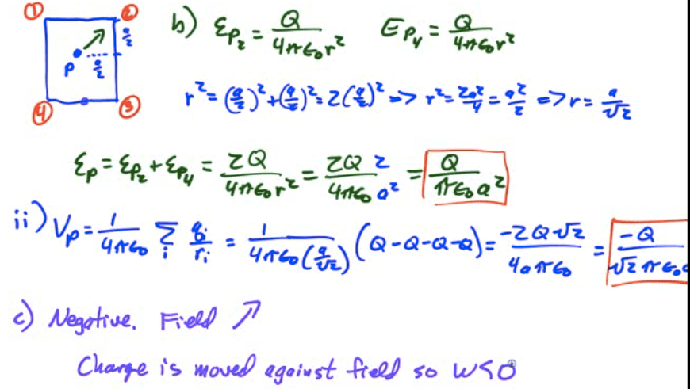
> 
> 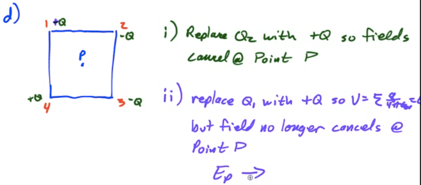

# 2005 Free Response Question 1

> ![0.1 0.08 0.06 - 0.04 - 0.02 - 0.02 Consider the electric field
> diagram above. 0.04 0.06 0.08 0.1 (a) Points A, B, and C are all
> located at y = 0.06 m . i. At which of these three points is the
> magnitude of the electric field the greatest? Justify your answer. ii.
> At which of these three points is the electric potential the greatest?
> Justify your answer. (b) An electron is released from rest at point B.
> i. Qualitatively describe the electron's motion in terms of direction,
> speed, and acceleration. ii. Calculate the electron's speed after it
> has moved through a potential difference of 10 V. (c) Points B and C
> are separated by a potential difference of 20 V. Estimate the
> magnitude of the electric field midway between them and state any
> assumptions that you make. (d) On the diagram, draw an equipotential
> line that passes through point D and intersects at least three
> electric field lines. ](./media/image113.png)
> 
> 
> 
> 

# 2003 Free Response Question 1

> ![A spherical cloud of charge of radius R contains a total charge +Q
> with a nonuniform volume charge density that varies according to the
> equation p(r) = PO(I for r R and p = O for r \> R, where r is the
> distance from the center of the cloud. Express all algebraic answers
> in terms of Q, R, and fundamental constants. (a) (b) (c) (d) (e)
> Determine the following as a function of r for r \> R. i. The
> magnitude E of the electric field ii. The electric potential V A
> proton is placed at point P shown above and released. Describe its
> motion for a long time after its release. An electron of charge
> magnitude e is now placed at point P, which is a distance r from the
> center of the sphere, and released. Determine the kinetic energy of
> the electron as a function of r as it strikes the cloud. Derive an
> expression for po . Determine the magnitude E of the electric field as
> a function of r for r R . ](./media/image116.png)
> 
> 
> 
> 
> 
> 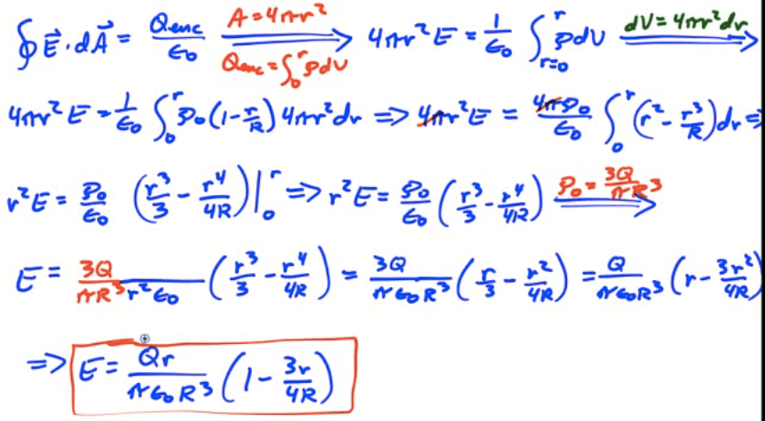

 

 

1.5 - Electric Potential Due to Continuous Charge Distributions

Wednesday, March 1, 2017

2:50
> PM

 

# Potential Due to a Charged Ring

> 

  - > Find the electric potential on the axis of a uniformly charged
    > ring of radius R and total charge Q at point P located a distance
    > z from the center of the
    > ring

  - > 

  - > 

  - > 

# Potential Due to a Charged Disk

> 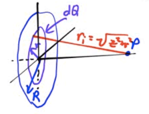

  - > Find the electric potential on the axis of a uniformly charged
    > disk of radius R and total charge Q at point P located a distance
    > z from the center of the
> ring

> 
> 
> 
> 
> 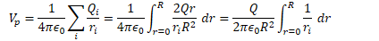
> 
> 
> 
> 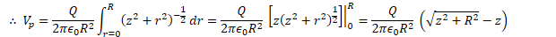

# Potential Due to a Spherical Shell of Charge

> 

  - > Find the electric potential both inside and outside a uniformly
    > charged shell of radius R and total charge
    > Q

  - > 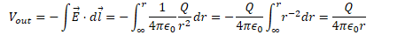

  - > 

> 

# Potential Due to a Uniform Solid Sphere

> 

  - > Find the electric field and electric potential inside a uniformly
    > charged solid insulating sphere of radius R and total charge
    > Q

  - > 

  - > 

  - > 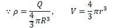

  - > 

  - > 

  - > 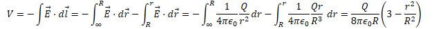

# 2012 Free Response Question 1

> ![0.20 m 0.10 m -100 v +100 V Two thin, concentric, conducting
> spherical shells, insulated from each other, have radii of 0.10 m and
> 0.20 m, as shown above. The inner shell is set at an electric
> potential of —100 V , and the outer shell is set at an electric
> potential of +100 V, with each potential defined relative to the
> conventional reference point. Let Q and Q represent the net charge on
> the inner and outer shells, respectively, and let r be the radial
> distance from the center of the shells. Express all algebraic answers
> in terms of Q, Qo , r, and fundamental constants, as appropriate. (a)
> Using Gauss's Law, derive an algebraic expression for the electric
> field E(r) for 0.10 m \< r \< 0.20 m . (b) Determine an algebraic
> expression for the electric field E(r) for r \> 0.20 m . (c) Determine
> an algebraic expression for the electric potential V(r) for r \> 0.20
> m . (d) Using the numerical information given, calculate the value of
> the total charge QT on the two spherical shells (QT =Q+QO).
> ](./media/image141.png)
> 
> 
> 
> 
> 
> 
> 
> 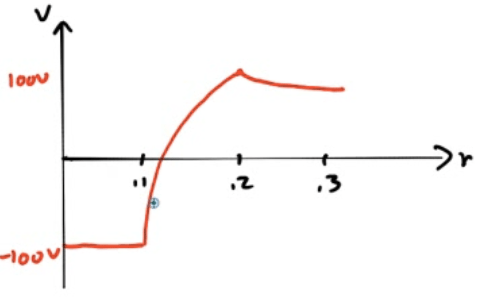

# 2010 Free Response Question 1

> ![+Q E\&M. 1. Figure I A charge +Q is uniformly distributed over a
> quarter circle of radius R, as shown above. Points A, B, and C are
> located as shown, with A and C located symmetrically relative to the
> x-axis. Express all algebraic answers in terms of the given quantities
> and fundamental constants. (a) Rank the magnitude of the electric
> potential at points A, B, and C from greatest to least, with number 1
> being greatest. If two points have the same potential, give them the
> same ranking. Justify your rankings. Point P is at the origin, as
> shown below, and is the center of curvature of the charge
> distribution. +Q Figure Il ](./media/image146.png)
> 
> 
> 
> 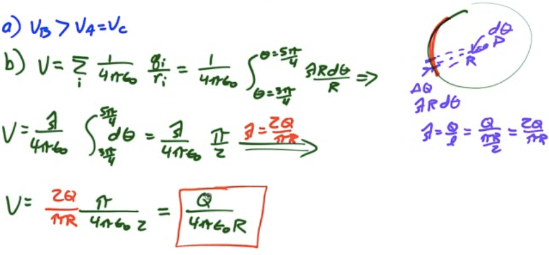
> 
> 

# 2009 Free Response Question 1

> ![A spherically symmetric charge distribution has net positive charge
> Q) distributed within a radius of R. Its electric potential V as a
> function of the distance r from the center of the sphere is given by
> the following. V(r) = 2 -2+3 for r \< R 41t€0R V(r) = for r \> R
> 41t€or Express all algebraic answers in terms of the given
> quantities and fundamental constants. (a) For the following regions,
> indicate the direction of the electric field E(r) and derive an
> expression for its magnitude. Radially inward ii. r \> R Radially
> inward Radially outward Radially outward (b) For the following
> regions, derive an expression for the enclosed charge that generates
> the electric field in that region, expressed as a function of r. ii. r
> \> R (c) Is there any charge on the surface of the sphere (r = R) ?
> Yes No If there is, determine the charge. In either case, explain your
> reasoning. ](./media/image150.png)
> 
> 
> 
> 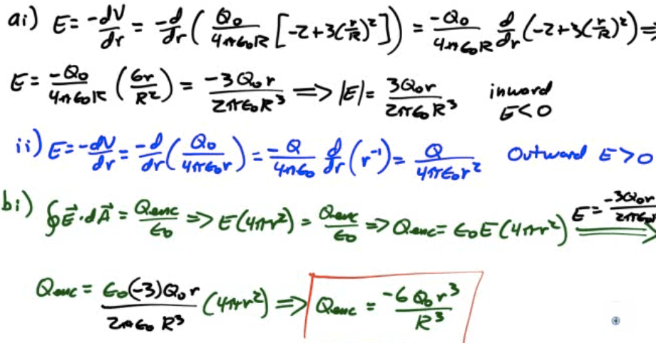
> 
> 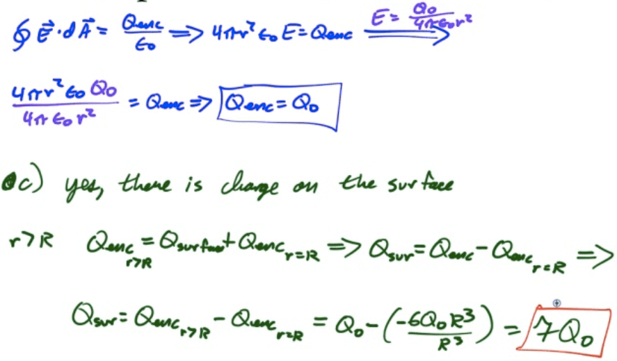
> 
> 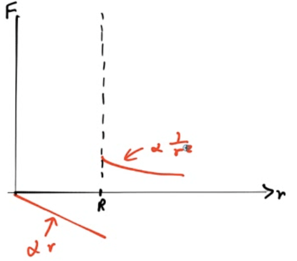

# 2007 Free Response Question 2 

> ![-Q In the figure above, a nonconducting solid sphere of radius a
> with charge +Q uniformly distributed throughout its volume is
> concentric with a nonconducting spherical shell of inner radius 2a and
> outer radius 3a that has a charge —Q uniformly distributed throughout
> its volume. Express all answers in terms of the given quantities and
> fundamental constants. (a) Using Gauss's law, derive expressions for
> the magnitude of the electric field as a function of radius rin the
> following regions. i. Within the solid sphere (r \< a) ii. Between the
> solid sphere and the spherical shell (a \< r \< 2a) iii. Within the
> spherical shell (2a \< r \< 3a ) iv. Outside the spherical shell (r \>
> 3a) (b) What is the electric potential at the outer surface of the
> spherical shell ( r = 3a )? Explain your reasoning. (c) Derive an
> expression for the electric potential difference Vx — VY between
> points X and Y shown in the figure. ](./media/image155.png)
> 
> 
> 
> 
> 
> 

 

 

1.6 - Conductors

Wednesday, March 1, 2017

4:11 PM

 

# Charges in a Conductor

  - > Charge is free to move until the E=0

> 

  - > All charge resides at surface

> 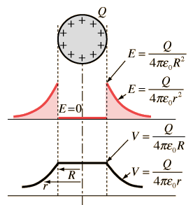

  - > Field lines are perpendicular to the surface

> 

# Electric Field at the Surface of a Conductor

  - > 

  - > 

  - > 

  - > 

  - > E increases as r σ increases.

# Hollow Conductors

> 
> 
> 

# Example 1: Conducting Spheres Connected by a Wire

> 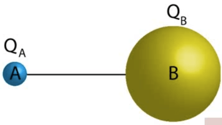

  - > Two conducting spheres, A and B, are placed a large distance from
    > each other. The radius of Sphere A is 5 cm, and the radius of
    > Sphere B is 20 cm. A charge Q of 200 nC is placed on Sphere A,
    > while Sphere B is uncharged. The spheres are then connected by a
    > wire. Calculate the charge on each sphere after the wire is
    > connected

  - > 

  - > 

  - > 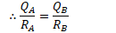

  - > 

  - > 

  - > 

# 2004 Free Response Question

> ![Conductor E\&M. 1. r2 111 11 1 0+1 •d •a Conductor Cross Section The
> figure above left shows a hollow, infinite, cylindrical, uncharged
> conducting shell of inner radius rl and outer radius r2 . An infinite
> line charge of linear charge density +1 is parallel to its axis but
> off center. An enlarged cross section of the cylindrical shell is
> shown above right. (a) On the cross section above right, i. sketch the
> electric field lines, if any, in each of regions I, Il, and Ill and
> ii. use + and — signs to indicate any charge induced on the conductor.
> (b) In the spaces below, rank the electric potentials at points a, b,
> c, d, and e from highest to lowest (1 = highest potential). If two
> points are at the same potential, give them the same number.
> ](./media/image175.png)
> 
> 
> 
> ![Nonconductor Nonconductor Cross Section (c) The shell is replaced by
> another cylindrical shell that has the same dimensions but is
> nonconducting and carries a uniform volume charge density +P . The
> infinite line charge, still of charge density +1 , is located at the
> center of the shell as shown above. Using Gauss's law, calculate the
> magnitude of the electric field as a function of the distance r from
> the center of the shell for each of the following regions. Express
> your answers in terms of the given quantities and fundamental
> constants.
> ](./media/image177.png)
> 
> 

 

 

1.7 - Capacitors

Wednesday, March 1, 2017

4:57 PM

 

# What is a Capacitor?

  - > A capacitor is an electric device used to store electrical energy
    
      - > Two conducting plates
    
      - > Insulating material between (dielectric)

  - > Place opposite charges on each plate

  - > Develop a potential difference across the plates

  - > Energy is stored in the electric field between the plates

> 

# Capacitance

  - > Capacitance (C) is the ratio of the charge separated on the plates
    > of a capacitor to the potential difference between the plates

  - > Units of capacitance are coulombs/volt, or farads (F)
    
      - > A farad is a very large amount of capacitance

> 

# Calculating Capacitance

1.  > Assume a charge of +Q and -Q on each conductor

2.  > Find the electric field between the conductors (Gauss's
    > Law)

3.  > 

4.  > 

# Example 1: Parallel Plates

> 

  - > Determine the capacitance between identical parallel plates of
    > area A separated by a distance d

<!-- end list -->

1.  > Assume +Q and
    > -Q

2.  > 

3.  > 

> 
> 
> 

1.  > 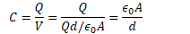

# Example 2: Cylindrical Capacitor

  - > 

<!-- end list -->

1.  > Assume +Q and
    > -Q

<!-- end list -->

1.  > 

> 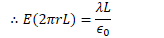
> 
> 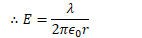

1.  > 

> 
> 
> 

1.  > 

# Example 3: Spherical Capacitor

> 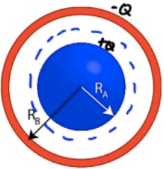

  - > 

<!-- end list -->

1.  > Assume +Q and
    > -Q

<!-- end list -->

1.  > 

> 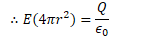
> 
> 

1.  > 

> 
> 
> 

1.  > 

# Energy Stored in a Capacitor

  - > Work is done charging a capacitor, allowing the capacitor to store
    > energy.

  - > 

  - > 

  - > 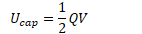

  - > 

  - > 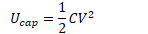

> 

# Field Energy Density

  - > 

  - > 

> 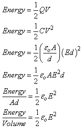

# Dielectrics

  - > Insulating Materials

> 
> 
> 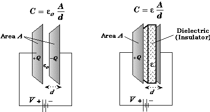
> 
>  

# Dielectric Constant (κ)

> 
> 
> 

# Example 4: Capacitors in Series

> 

  - > Determine the equivalent capacitance of two capacitors in
    > series

  - > 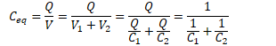

  - > 

> 

# Example 5: Capacitors in Parallel

> 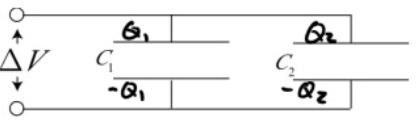

  - > Determine the equivalent capacitance of two capacitors in
    > parallel

  - > 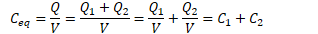

> 

# Example 6: Capacitance

  - > A capacitor stores 3 microcoulombs of charge with a potential
    > difference of 1.5 volts across the plates. What is its
    > capacitance? How much energy is stored in the
    > capacitor?

  - > 

  - > 

# Example 7: Charge on a Capacitor

> 

# Example 8: Designing a Capacitor

> 

# Example 9: Calculating Capacitance

> 

# Example 10: Two Conducting Spheres

> 

# Example 11: Inserting a Dielectric

> 

 

 

2.1 - Current & Resistance

Thursday, March 2, 2017

8:32 AM

 

# Electric Current

  - > Electric current is the flow rate of electric charge
    
      - > Units are C/s, or amperes (A)
    
      - > Positive current flow is the direction of the flow of positive
        > charges, which is opposite the direction of electron
    > flow

  - > 

# Drift Velocity

  - > In a conductor, electrons are inconstant thermal motion.

  - > Net electron flow, however, is zero because the motion is random

  - > When an electric field is applied, a small net flow in a direction
    > opposite the electric field is
    > observed

  - > 

# Derivation of Current Flow

> 
> 
> 

# Current Density

  - > 

> 
> 
> ![f J.dS currenö region \[Total Current\] = Sum of Current Density
> over the region where the current flows ](./media/image237.png)

# Resistance

  - > Resistance is the ratio of the potential drop across an object to
    > the current flowing through the object.

  - > Object which have a fixed resistance (not a function of current of
    > potential drop) are known as Ohmic materials and are said to
    > follow Ohm's Law (an empirical law)

> 

# Resistance of a Wire

  - > The resistance of a wire depends on the geometry of the wire as
    > well as a material property known as resistivity ⍴ (Unit: Ω·m)

  - > Resistivity relates to the ability of a material to resist the
    > flow of electrons

> 

# Refining Ohm's Law

  - > 

  - > 

  - > 

  - > 

# Conversion of Electric Energy to Thermal Energy

  - > 

  - > 

  - > 

# Example 1: Silver Wire

  - > 

<!-- end list -->

1.  > Determine the resistance of the
        > wire
    
      - > 

2.  > Determine the current flowing through the
        > wire
    
      - > 

3.  > Determine the drift velocity of the free electrons in the wire
    > (assume one free electron per
        > atom)
    
      - > 
    
      - > 
    
      - > 

4.  > Determine the average time required for electrons to pass from the
    > negative terminal of the battery to the positive
        > terminal
    
      - > 

# Example 2: Aluminum Wire

  - > 

  - > 

 

 

2.2 - Circuits I: Series Circuits

Thursday, March 2, 2017

8:32 AM

 

# Electrical Circuits

  - > An electrical circuit is a closed-loop path through which current
    > can flow

  - > An electrical circuit can be made up of most any materials but
    > practically speaking, circuits are typically comprised of
    > electrical devices
    
      - > Wires
    
      - > Batteries
    
      - > Resistors
    
      - > Switches

  - > Conventional current flows from high potential to low potential

# Voltmeters

  - > Voltmeters measure the potential difference between two points in
    > a circuit

  - > Voltmeters are connected in parallel with the element to be
    > measured

  - > If a voltmeter is connected correctly, you can remove it from the
    > circuit without breaking the circuit

  - > Voltmeters have very high
> resistance

> 

# Ammeters

  - > Ammeters measure the current flowing through an element of a
    > circuit

  - > Ammeters are connected in series with the circuit, so that the
    > current to be measured flows through the ammeter

  - > The circuit must be broken to correctly insert an ammeter

  - > Ammeters have very low resistance to minimize the potential drop
    > through the
> ammeter

> 

# Series Circuits

  - > Series circuits have only a single current path

  - > Removal of any circuit element causes an open circuit

> 

# Kirchhoff's Laws

  - > Kirchhoff's Laws are tools utilized in analyzing circuits

  - > Kirchhoff's Current Law (KCL) states that the sum of all current
    > entering any point in a circuit equals the sum of all current
    > leaving any point in a circuit
    
      - > Restatement of conservation of charge
    
      - > aka "Junction Rule"

  - > Kirchhoff's Voltage Law (KVL) states that the sum of all the
    > potential drops in any closed loop of a circuit has to equal zero
    
      - > Restatement of conservation of energy
    
      - > aka "Loop Rule"

> 

 

 

2.3 - Circuits II: Parallel Circuits

Thursday, March 2, 2017

8:32 AM

 

# Parallel Circuits

  - > Parallel Circuits have multiple current paths

  - > Removal of a circuit element may allow other branches of the
    > circuit to continue
> operating

> 

# Combination Series-Parallel Circuits

  - > A circuit doesn't have to be completely serial or parallel

  - > First, look for portions of the circuit with parallel elements.

  - > Replace parallel resistors with an equivalent single resistor

  - > Work back to original circuit using KCL and KVL until you know the
    > current, voltage, and resistance of each individual circuit
    > element

  - > Often times will lead to systems of equations to solve

# Example 1: Two Voltage Sources

  - > Find the current flowing through R3 if R3 has a value of 6 ohms.
    > What is the power dissipated in R3?

> 

# Batteries

  - > A cell or battery (combination of cells) provides a potential
    > difference, oftentimes referred to as an electromotive force or
    > emf.

  - > A battery can be thought of as a pump for charge, raising it from
    > a lower potential to a higher potential

  - > Ideal batteries have no
    > resistance

  - > 

  - > In real batteries, the terminal voltage is slightly lower than the
    > battery's
> emf

> 

# Ideal Battery

> 

# Real Battery

> 

 

 

2.4 - RC Circuits: Steady State

Thursday, March 2, 2017

9:55 AM

 

# Capacitors in Parallel

  - > Capacitors store charge on their plates

  - > Capacitors in parallel can be replaced with an equivalent
    > capacitor

  - > 

# Capacitors in Series

  - > Charge on capacitors must be the same

  - > Capacitors in series replaced with an equivalent
    > capacitor

  - > 

# RC Circuits

  - > RC Circuits are circuits comprised of a source of potential
    > difference, a resistor network, and one or more capacitors

  - > We will look at RC circuits from the steady-state perspective
    
      - > What happens when first turned on
    
      - > What happens after a "long" time has elapsed

  - > Key to understanding RC Circuit Performance
    
      - > Uncharged capacitors act like wires
    
      - > Charged capacitors act like opens

# Charging an RC Circuit

> 
> 
> 
> 
> 

# Discharging an RC Circuit

> 
> 
> 
> 
> 

# The Time Constant

  - > 

  - > 

> 

# Example 1: RC Analysis

> 

  - > What is the current through R2 when the circuit is first
    > connected?

> 

  - > What is the current through R2 a long time after the circuit has
    > been
> connected?

> 

# Example 2: More RC Analysis

> 

  - > What is the current through R3 when the circuit is first
    > connected?

> 

  - > What is the current through R2 a long time after the circuit has
    > been
> connected

> 

# Example 3: Equivalent Capacitance

  - > What is the equivalent capacitance of the capacitor network shown
    > below?

> 

# Example 4: More Equivalent Capacitance

  - > What is the equivalent capacitance of the capacitor network shown
    > below?

> 

# 2010 Free Response Question 2

> ![40 Q 5.0 10 20 Q 30 v In the circuit illustrated above, switch S is
> initially open and the battery has been connected for a long time. (a)
> What is the steady-state current through the ammeter? (b) Calculate
> the charge on the 10 PF capacitor. (c) Calculate the energy stored in
> the 5.0 PF capacitor. The switch is now closed, and the circuit comes
> to a new steady state. (d) Calculate the steady-state current through
> the battery. (e) Calculate the final charge on the 5.0 gF capacitor.
> (f) Calculate the energy dissipated as heat in the 40 Q resistor in
> one minute once the circuit has reached steady state.
> ](./media/image285.png)
> 
> 
> 
> 

# 2004 Free Response Question 2

> ![20 v — E\&M. 2. 15kQ c 20 14 12 8 6 2 0 5 10 Time (s) 15 In the
> circuit shown above left, the switch S is initially in the open
> position and the capacitor C is initially uncharged. A voltage probe
> and a computer (not shown) are used to measure the potential
> difference across thc capacitor as a function of time after the switch
> is closed. The graph produced by the computer is shown above right.
> The battery has an emf of 20 V and negligible internal resistance.
> Resistor RI has a resistance of 15 kQ and the capacitor C has a
> capacitance of 20 gF. (a) (b) (c) (d) Determine the voltage across
> resistor R2 immediately after the switch is closed. Determine the
> voltage across resistor R2 a long time after the switch is closed.
> Calculate the value of the resistor R2. Calculate the energy stored in
> the capacitor a long time after the switch is closed.
> ](./media/image288.png)
> 
> 
> 
> ![(e) On the axes below, graph the current in R2 as a function of time
> from 0 to 15 s. Label the vertical axis with appropriate values. - -h
> F + - -l -l - --4---L--lr-- Current in R2 10 15 Time (s) Resistor R2
> is removed and replaced with another resistor of lesser resistance.
> Switch S remains closed for a long time. (D Indicate below whether the
> energy stored in the capacitor is greater than, less than, or the same
> as it was with resistor R2 in the circuit. Greater than Explain your
> reasoning. Less than The same as
> ](./media/image290.png)
> 
> 

 

 

2.5 - RC Circuits: Transient Analysis

Thursday, March 2, 2017

9:55
> AM

 

# Charging an RC Circuit

> 

  - > 

  - > 

  - > 

  - > 

  - > 

  - > 

  - > 

  - > 

  - > 

  - > 

# Discharging an RC Circuit

> 

  - > 

  - > 

  - > 

  - > 

  - > 

  - > 

  - > 

  - > 

  - > 

  - > 

# 2013 Free Response Question 2

> ![c In a lab, you set up a circuit that contains a capacitor C, a
> resistor R, a switch S, and a power supply, as shown in the diagram
> above. The capacitor is initially uncharged. The switch, which is
> initially open, can be moved to positions A or B. (a) i. Indicate the
> position to which the switch should be moved to charge the capacitor.
> ii. On the diagram, draw a voltmeter that is properly connected to the
> circuit in a manner that will allow the voltage to be measured across
> the capacitor. After a long time you move the switch to discharge the
> capacitor, and your lab partner starts a stopwatch. You collect the
> following measurements of the voltage across the capacitor at various
> times. 6 252 18 74 30 33 42 10 54 6 You wish to determine the time
> constant T of the circuit from the slope of a linear graph. (b) .
> Indicate two quantities you would plot to obtain a linear graph. ii.
> Use the remaining rows in the table above, as needed, to record any
> quantities that you indicated that are not given. Label each row you
> use and include units.
> ](./media/image314.png)
> 
> 
> 
> ![(c) On the axes below, graph the data from the table that will
> produce a linear relationship. Clearly scale and label all axes
> including units, if appropriate. Draw a straight line that best fits
> your data points. cru -J \_J 4 4.-4 4. 4 4. 4. (d) From your line in
> part (c), obtain the value of the time constant T of the circuit. (e)
> . In the experiment, the capacitor C had a capacitance of 1.50 gF.
> Calculate an experimental value for the resistance R. ii. On the axes
> in part (c), use a dashed line to sketch a possible graph if the
> capacitance was greater than 1.50 gF but the resistance R was the
> same. Justify your answer. ](./media/image316.png)
> 
> 

# 2012 Free Response Question 2

> ![0.02 ml Paper Strip A physics student wishes to measure the
> resistivity of slightly conductive paper that has a thickness of 1.0 x
> 10-4 m . The student cuts a sheet of the conductive paper into strips
> of width 0.02 m and varying lengths, making five resistors labeled RI
> to R5. Using an ohmmeter, the student measures the resistance of each
> strip, as shown above. The data are recorded below. Resistor Length
> (m) Resistance ( Q ) RI 0.020 80,000 0.040 180,000 0.060 260,000 0.080
> 370,000 0.100 440,000 (a) Use the grid below to plot a linear graph of
> the data points from which the resistivity of the paper can be
> determined. Include labels and scales for both axes. Draw the straight
> line that best represents the data. (b) Using the graph, calculate the
> resistivity of the paper. ](./media/image318.png)
> 
> 
> 
> ![Capacitor R4 Switch Battery The student uses resistors R4 and R5 to
> build a circuit using wire, a 1.5 V battery, an uncharged 10 BF
> capacitor, and an open switch, as shown above. (c) Calculate the time
> constant of the circuit. (d) At time t = 0, the student closes the
> switch. On the axes below, sketch the magnitude of the voltage Vc
> across the capacitor and the magnitudes of the voltages VR4 and VR5
> across each resistor as functions of time t. Clearly label each curve
> according to the circuit element it represents. On the axes,
> explicitly label any intercepts, asymptotes, maxima, or minima with
> values or expressions, as appropriate. Time t ](./media/image320.png)
> 
> 

# 2007 Free Response Question 1

> ![Switch R = 550 Q C = 4000gF A student sets up the circuit above in
> the lab. The values of the resistance and capacitance are as shown,
> but the constant voltage E delivered by the ideal battery is unknown.
> At time t = 0, the capacitor is uncharged and the student closes the
> switch. The current as a function of time is measured using a computer
> system, and the following graph is obtained. 2.5 2.0 1.0 0.5 O 2 4 6
> lime (s) 8 10 Using the data above, calculate the battery voltage E .
> (a) (b Calculate the voltage across the capacitor at time t = 4.0 s.
> Calculate the charge on the capacitor at t = 4.0 s. (c)
> ](./media/image322.png)
> 
> 
> 
> ![(d) On the axes below, sketch a graph of the charge on the capacitor
> as a function of time. 10 Time (s) (e) Calculate the power being
> dissipated as heat in the resistor at t = 4.0 s. (f) The capacitor is
> now discharged, its dielectric of constant K = 1 is replaced by a
> dielectric of constant K = 3 , and the procedure is repeated. Is the
> amount of charge on one plate of the capacitor at t = 4.0 s now
> greater than, less than, or the same as before? Justify your answer.
> Greater than Less than The same ](./media/image324.png)
> 
> 

# 2006 Free Response Question 2

> ![c The circuit above contains a capacitor of capacitance C, a power
> supply of emf e , two resistors of resistances RI and R2 , and two
> switches, Sl and S2 . Initially, the capacitor is uncharged and both
> switches are open. Switch Sl then gets closed at time t = O. (a) Write
> a differential equation that can be solved to obtain the charge on the
> capacitor as a function of time t. (b) Solve the differential equation
> in part (a) to determine the charge on the capacitor as a function of
> time t. Numerical values for the components are given as follows: e =
> 12 v C = 0.060 F RI = = 4700 Q (c) Determine the time at which the
> capacitor has a voltage 4.0 V across it. After switch Sl has been
> closed for a long time, switch S2 gets closed at a new time t = O.
> ](./media/image326.png)
> 
> 
> 
> 
> 
> 

# 2003 Response Question 2

> ![In the laboratory, you connect a resistor and a capacitor with
> unknown values in series with a battery of emf E = 12 V . You include
> a switch in the circuit. When the switch is closed at time t = 0, the
> circuit is completed, and you measure the current through the resistor
> as a function of time as plotted below. 0.010 0.005 4 8 12 16 e e-t/4
> A data-fitting program finds that the current decays according to the
> equation i(t) = (a) Using common symbols for the battery, the
> resistor, the capacitor, and the switch, draw the circuit that you
> constructed. Show the circuit before the switch is closed and include
> whatever other devices you need to measure the current through the
> resistor to obtain the above plot. Label each component in your
> diagram. (b) Having obtained the curve shown above, determine the
> value of the resistor that you placed in this circuit. (c) What
> capacitance did you insert in the circuit to give the result above?
> ](./media/image330.png)
> 
> 
> 
> ![You are now asked to reconnect the circuit with a new switch in such
> a way as to charge and discharge the capacitor. When the switch in the
> circuit is in position A, the capacitor is charging; and when the
> switch is in position B, the capacitor is discharging, as represented
> by the graph below of voltage Vc across the capacitor as a function of
> time. Vc(V) Switch at A Charging 12 6 4 8 12 Switch at B Discharging
> 16 20 24 28 32 (d) Draw a schematic diagram of the RC circuit that you
> constructed that would produce the graph above. Clearly indicate
> switch positions A and B on your circuit diagram and include whatever
> other devices you need to measure the voltage across the capacitor to
> obtain the above plot. Label each component in your diagram.
> ](./media/image332.png)
> 
> 

 

 

3.1 - Magnets

Friday, March 3, 2017

9:15 AM

 

# Magnetism

  - > Magnetism is a force caused by moving charges

  - > Magnets are dipoles (they have a north and a south)

  - > Like poles repel, opposite poles attract

  - > Magnetic domains are clusters of atoms with electrons spinning in
    > the same direction
    
      - > Random domains: no net magnetic field
    
      - > When many of the domains line up, you get a net magnetic
        > field, creating a strong magnet

> 

# Magnetic Fields

  - > 
    
      - > Units a Tesla (T)

  - > Magnets are polarized (each has two opposite ends)
    
      - > End of a magnet that points toward the geographic north pole
        > of the Earth is called the north pole of the magnet
    
      - > There are no magnetic monopoles

# Magnetic Field Lines

  - > Magnetic Field Lines make closed loops and run from north to south
    > outside the magnet
    
      - > Magnet field lines show the direction the north pole of a
        > magnet would tend to point if placed in the
    > field

  - > 

> 

# The Compass

  - > The Earth is a giant magnet

  - > The Earth's magnetic north pole is located near the geographic
    > south pole, and vice versa
    
      - > A compass's north magnet pole points toward the Earth's
        > magnetic south pole (geographic north)

  - > A compass lines up with the net magnetic field

> 

# Magnetic Permeability

  - > Magnetic permeability refers to the ratio of magnetic field
    > strength induced in a material to the magnetic field strength of
    > the induced
> field

> 

  - > Free space has a constant value of magnetic permeability that
    > appears in physical
> relationships

> 

  - > The permeability of matter has a value different from that of free
    > space

  - > Highly magnetic materials (such as iron) have higher values of
    > magnetic permeability

# Magnetic Dipole Moment

  - > The magnetic dipole moment of a magnet refers to the force that a
    > magnet can exert on moving charges

  - > Can be thought of in simplistic terms as the relative strength of
    > a magnet
    
      - > Compare the magnetic dipole moment of a hydrogen atom to the
        > magnetic dipole moment of a highly magnetized iron bar
    
      - > Fe \> H

> 

 

 

3.2 - Moving Charges In Magnetic Fields

Friday, March 3, 2017

9:15
    > AM

 

# Magnetic Fields

  - > 

  - > 

  - > 1 Tesla is a very strong magnetic field

  - > More common non-SI units is the
    > Gauss

  - > 

  - > Earth's magnetic field strength ≈ 0.5 Gauss

# Forces on Moving Charges

  - > The magnetic force is always perpendicular to the charged object's
    > velocity, therefore the magnetic force on a moving charge is never
    > applied in the direction of the displacement, therefore a magnetic
    > force can do no work on a moving charge (but it can change its
    > direction)

  - > 

  - > 

> 

# Direction of the Magnetic Force

  - > Direction of the force given by right-hand rule
    
      - > Point fingers of right hand in direction of positive
        > particles' velocity
    
      - > Curl fingers inward in the direction of the magnetic field
    
      - > Thumb points in the direction of the force on charged particle

> 

# Path of Charged Particles in B Fields

  - > Magnetic force cannot perform work on a moving charge

  - > Magnetic force can change its direction (moving it in a circle if
    > the magnetic force is constant)

> 

# Total Force on a Moving Charged Particle

  - > E field can do work on a moving charge

  - > B filed can never do work on a moving charge

  - > Lorentz Force

> 

# Velocity Selector

  - > A charged particle in crossed E and B fields can undergo constant
    > velocity motion is v, B, and E are all selected perpendicular to
    > each
    > other

  - > 

> 
> 
> 

# Mass Spectrometer

  - > Magnetic fields accelerate moving charges so that they travel in a
    > circle

  - > This can be used to determine the mass of an unknown particle\!

> 

# Example 1: Velocity Selector 

  - > Find the speed of a charged particle which passes through a
    > velocity selector with magnetic field strength of 1 Tesla
    > perpendicular to an electric field of 600,000
    > N/C

  - > 

  - > 

  - > 

# Example 2: Mass Spectrometer

> 

  - > A proton is accelerated through a potential difference V before
    > passing into a region of uniform magnetic field B as shown

<!-- end list -->

1.  > Determine the voltage necessary to give the proton a speed v as it
    > enters the magnetic field region in terms of the proton's mass m,
    > its velocity v, and its charge,
        > q.
    
      - > 
    
      - > 

2.  > Determine an expression for the radius of the proton's motion in
    > the uniform magnetic field
        > region
    
      - > 
    
      - > 

<!-- end list -->

1.  > Sketch the path of the proton in the magnetic field

> 

1.  > An electric field is applied in the same region as the uniform
    > magnetic field. Determine the magnitude and direction of electric
    > field required so that the proton passes through the region in a
    > straight
        > line
    
      - > 
    
      - > 
    
      - > 

 

 

3.3 - Forces on Current-Carrying Wires

Friday, March 3, 2017

9:15 AM

 

# Forces on Current-Carrying Wires

  - > Moving charges in magnetic fields experience forces.

  - > Current in a wire is just a flow of charges.

  - > If charges are moving perpendicular to magnetic fields, they
    > experience a force which is applied to the
> wire.

> 
> 
> 
> 
> 
> 
> 
> 
> 
> 
> 
> 
> 
> 
> 
> 
> 
> 
> 

# Example 1: Current Through a Wire

> 

  - > A straight wire of length 1 m carries a current of 100 A through a
    > magnetic field of 1 Tesla. Find the force on the
    > wire

  - > 

# Electric Motors

> 

# Example 2: Net Torque

  - > Determine the direction of the net torque on the current-carrying
    > closed
> circuit

> 

# Example 3: Force on a Curved Wire

> 

  - > The curved wire carries constant current I through a uniform
    > magnetic field B as shown. Find the net force acting on the
    > wire.

  - > 

  - > 

 

 

3.4 - Magnetic Fields Due to Current-Carrying Wires

Friday, March 3, 2017

11:50 AM

 

# Example 1: Torque on a Loop of Wire

  - > A loop of wire carrying current I is placed in a magnetic field.
    > Determine the net torque around the axis of rotation due to the
    > current in the wire.

> 

# Magnetic Field due to a Current-Carrying Wire

  - > Moving charges create magnetic fields

  - > Current-carrying wires carry moving charges, therefore they create
    > B fields

  - > Direction given by right-hand rule

  - > For multiple wires, determine B field from each and add them up
    > using superposition

  - > B fields may interact with other moving charges, so
    > current-carrying wires can exert forces upon each other.

# First Right Hand Rule

> 

  - > "Hold" wire with your right hand, thumb in direction of positive
    > current flow

  - > Your fingers wrap in the direction of the magnetic
    > field

  - > 

  - > 

# Example 2: Magnetic Field due to a Wire

  - > A wire carries a current of 6 amperes to the left.

  - > Find the magnetic field at point P, located 0.1 meters below the
    > wire

> 

# Force Between Parallel Current-Carrying Wires

  - > Use right hand rules to determine force between parallel
    > current-carrying wires

  - > Find magnetic field due to first wire. Draw it.

  - > Find direction of force on second wire due to current in second
    > wire. Force on the first wire will be equal and opposite (Newton's
    > third Law)

> 

# Gauss's Law for Magnetism

  - > You can never draw a closed surface with any net magnetic flux
    > because there are no magnetic monopoles.

  - > This is the basis of Gauss's Law for Magnetism (Maxwell's second
    > equation)

  - > 

> 

# Example 3: Field due to Wires

  - > Two long current-carrying wires are separated by a distance d as
    > shown.

  - > What is the net magnetic field due to these wires at point P,
    > located midway between the two wires, if the top wire carries a
    > current of 3A and the bottom wire caries a current of 5A.

  - > 

# Example 4: Force on a Wire

  - > A 5-m long straight wire runs at a 45-degree angle to a uniform
    > magnetic field of 5 T. If the force on the wire is 1N, determine
    > the current in the
    > wire

  - > 

  - > 

# 2009 Free Response Question 2

> ![5.0 x 10-61112 9.0 v A 9.0 V battery is connected to a rectangular
> bar of length 0.080 m, uniform cross-sectional area 5.0 x 10 m and
> resistivity 4.5 x 10 , as shown above. Electrons are the sole charge
> carriers in the bar. The wires have negligible resistance. The switch
> in the circuit is closed at time t = O . (a) Calculate the power
> delivered to the circuit by the battery. (b) On the diagram below,
> indicate the direction of the electric field in the bar. b Side View
> Explain your answer. (c) Calculate the strength of the electric field
> in the bar. A uniform magnetic field of magnitude 0.25 T perpendicular
> to the bar is added to the region around the bar, as shown below. 5.0
> x 10-61112 x a X X 9.0 v 0.25 T (d) Calculate the magnetic force on
> the bar. X X X x x X X X x X X X X X X X x X X X x X X X X x X x X b x
> X Side View ](./media/image393.png)
> 
> ![Eş\!\!\] z 72-2 z : 3 (2 u 22 91 • S • ](./media/image394.png)
> 
> 
> 
> 

 

 

3.5 - The Biot-Savart Law

Friday, March 3, 2017

2:15 PM

 

# Biot-Savart Law

  - > A "brute force" method of finding the magnetic field due to a
    > length of current-carrying
> wire

> 

# Example 1: Magnetic Field due to a Current Loop

  - > Derive the magnetic field due to a current loop at the center of
    > the loop

> 

# Example 2: Magnetic Field due to Long Straight Current-Carrying Wire

  - > Derive the magnetic field strength at a point P located a distance
    > R from an infinitely long current-carrying wire using the
    > Biot-Savart
> Law

> 
> 
> 

# Example 3: Magnetic Field due to A Current Loop

  - > Derive the magnetic field due to a current loop at a point out of
    > the plane of the loop but centered on the loop's axis as
> shown

> 
> 
> 

 

 

3.6 - Ampere's Law

Sunday, March 5, 2017

8:08 PM

 

# Ampere's Law

  - > Ampere's Law provides an elegant method of finding the magnetic
    > field due to current flowing in a wire in situations of planar and
    > cylindrical
> symmetry

> 
> 
> 

# Example 1: Magnetic Field of a Wire

> 

1.  > Find the magnetic field outside a current-carrying
    > wire

<!-- end list -->

  - > 

  - > 

  - > 

<!-- end list -->

1.  > Find the magnetic field inside a current-carrying
    > wire

<!-- end list -->

  - > 

  - > 

  - > 

<!-- end list -->

1.  > Graph the magnetic field of a current-carrying wire as a function
    > of the distance from the center of the
> wire

> 

# Example 2: Magnetic Field in a Solenoid

> 

  - > Calculate the magnetic field in the middle of a solenoid (i.e.
    > Slinky) using Ampere's
    > Law

  - > 

  - > 

  - > 

  - > 

# Example 3: Net Force on a Wire Loop

  - > 

  - > What is the direction of the net force on the
> loop?

> 

# 2011 Free Response Question 3

> ![b a Cross-sectional View (current into page) E\&M. 3. A section of a
> long conducting cylinder with inner radius a and outer radius b
> carries a current 10 that has a uniform current density, as shown in
> the figure above. (a) Using law, derive an expression for the
> magnitude of the magnetic field in the following regions as a function
> of the distance r from the central axis. i. ii. iii. r = 2b (b) On the
> cross-sectional view in the diagram above, indicate the direction of
> the field at point P, which is at a distance r = 2b from the axis of
> the cylinder. (c) An electron is at rest at point P. Describe any
> electromagnetic forces acting on the electron. Justify your answer.
> ](./media/image418.png)
> 
> 
> 
> 
> 
> 

# 2005 Free Response Question 3

> ![Hall Probe and Meter 0 10 20 30 40 50 60 70 80 90 100 A student
> performs an experiment to measure the magnetic field along the axis of
> the long, 100-turn solenoid PQ shown above. She connects ends P and Q
> of the solenoid to a variable power supply and an ammeter as shown.
> End P of the solenoid is taped at the 0 cm mark of a meterstick The
> solenoid can be stretched so that the position of end Q can be varied.
> The student then positions a Hall probe\* in the center of the
> solenoid to measure the magnetic field along its axis. She measures
> the field for a fixed current of 3.0 A and various positions of the
> end Q. The data she obtains are shown below. Trial Position of End Q
> Measured Magnetic Field (T) n (turns/m) 1 2 3 4 5 (cm) 40 50 60 80 100
> (directed from P to Q) \_4 9.70 x 10 —4 7.70 x 10 \_4 6.80 x 10 \_4
> 4.90 x 10 -4 4.00 x 10 (a) Complete the last column of the table above
> by calculating the number of turns per meter. \*A Hall Probe is a
> device used to measure the magnetic field at a point.
> ](./media/image422.png)
> 
> 
> 
> 
> 
> 

 

 

3.7 - Magnetic Flux

Sunday, March 5, 2017

8:08
    > PM

 

# Magnetic Flux

  - > 

  - > Units of magnetic flux are Weber
    > (Wb)

  - > 

> 

  - > 

  - > 

# Magnetic Flux Through Closed Surfaces

  - > Normal to closed surfaces point from the inside to the
> outside

> 
> 
> 

# Gauss's Law for Magnetism

  - > The total magnetic flux through any closed surface is zero

  - > This would not be true if magnetic monopoles were found to
    > exist

  - > 

# Example 1: Flux through a Circular Loop

> 

  - > Calculate the flux of 3-Tesla uniform magnetic field through the
    > circular loop of radius 0.2 meters with three turns of
    > wire

  - > 

# Example 2: Flux Due to a Wire

> 

  - > A long straight wire carries a current I as shown.

  - > Calculate the magnetic flux through the
    > loop

  - > 

 

 

3.8 - Faraday's Law & Lenz's Law

Sunday, March 5, 2017

9:54 PM

 

# Faraday's Law

  - > The induced emf due to a changing magnetic field is equal in
    > magnitude to the rate of change of the magnetic flux through a
    > surface bounded by the circuit

  - > The direction of the induced current is given by Lenz's
    > Law

  - > 

> 

# Lenz's Law

  - > The current induced by a changing magnetic flux creates a magnetic
    > field opposing the change in
> flux

> 

# Maxwell's Equations

> 

# Example 1: Induced Current in a Loop

> 

  - > 

<!-- end list -->

1.  > Find the generated emf as a function of
        > time
    
      - > 

2.  > Determine the current through the 100-ohm lamp as a function of
    > time
    
      - > 

3.  > What is the direction of the current through the loop at time
    > t=5s?
    
      - > 
    
      - > Clockwise, due to Lenz's
> Law

# Example 2: Rod on Rails

> 

  - > Consider a circuit in which a current-carrying rod on rails is
    > moved to the left with constant velocity v. If the circuit is
    > perpendicular to a constant magnetic field, determine the induced
    > emf in the
    > circuit

  - > 

# 2012 Free Response Question 3

> ![Crossbar X x x x X X X X x x x x X X 130 X X x X x x x X x X x X x X
> x x x X X X X x X X x X X X X A closed loop is made of a U-shaped
> metal wire of negligible resistance and a movable metal crossbar of
> resistance R. The crossbar has mass m and length L It is initially
> located a distance ho from the other end of the loop. The loop is
> placed vertically in a uniform horizontal magnetic field of magnitude
> Bo in the direction shown in the figure above. Express all algebraic
> answers to the questions below in terms of Bo , L, m, ho , R, and
> fundamental constants, as appropriate. (a) Determine the magnitude of
> the magnetic flux through the loop when the crossbar is in the
> position shown. The crossbar is released from rest and slides with
> negligible friction down the U-shaped wire without losing electrical
> contact. (b) On the figure below, indicate the direction of the
> current in the crossbar as it falls. Justify your answer. (c)
> Calculate the magnitude of the current in the crossbar as it falls as
> a function of the crossbar's speed v . ](./media/image449.png)
> 
> 
> 
> 
> 
> 

# 2010 Free Response Question 3

> ![Lightbulb (resistance R) E\&M. 3. The long straight wire illustrated
> above carries a current I to the right. The current varies with time t
> according to the equation I = 10 — Kt , where 10 and K are positive
> constants and I remains positive throughout the time period of
> interest. The bottom of a rectangular loop of wire of width b and
> height a is located a distance d above the long wire, with the long
> wire in the plane of the loop as shown. A lightbulb with resistance R
> is connected in the loop. Express all algebraic answers in terms of
> the given quantities and fundamental constants. (a) Indicate the
> direction of the current in the loop. Clockwise Justify your answer.
> Counterclockwise (b) Indicate whether the lightbulb gets brighter,
> gets dimmer, or stays the same brightness over the time period of
> interest. Gets brighter Justify your answer. Gets dimmer Remains the
> same (c) (d) (e) Determine the magnetic field at t = O due to the
> current in the long wire at distance r from the long wire. Derive an
> expression for the magnetic flux through the loop as a function of
> time. Derive an expression for the power dissipated by the lightbulb.
> ](./media/image453.png)
> 
> 
> 
> 

# 2009 Free Response Question 3

> ![x x x x E\&M. 3. x x 2 x x A square conducting loop of side L
> contains two identical lightbulbs, 1 and 2, as shown above. There is a
> magnetic field directed into the page in the region inside the loop
> with magnitude as a function of time t given by B (t) = at + b , where
> a and b are positive constants. The lightbulbs each have constant
> resistance Ro . Express all answers in terms of the given quantities
> and fundamental constants. (a) (b) (c) Derive an expression for the
> magnitude of the emf generated in the loop. i. Determine an expression
> for the current through bulb 2. ii. Indicate on the diagram above the
> direction of the current through bulb 2. Derive an expression for the
> power dissipated in bulb 1. ](./media/image456.png)
> 
> 
> 
> 
> 
> 
> 
> 

# 2008 Free Response Question 3

> 
> 
> 
> 
> ![1 Figure 2 Axis Figure 3 A second identical loop also carrymg a
> current I is added at a distance of R above the first loop, as shown
> in Figure 2 above. (b) Determine the magnitude of the net magnetic
> field Bnet at point P. A small square loop of wire in which each side
> has a length s is now placed at point P with its plane parallel to the
> plane of each loop, as shown in Figure 3 above. For parts (c) and (d),
> assume that the magnetic field between the two circular loops is
> uniform in the region of the square loop and has magnitude B net • (c)
> In terms of Bnet and s, determine the magnetic flux through the square
> loop. (d) The square loop is now rotated about an axis in its plane at
> an angular speed O. In terms of Bnet , s, and o , calculate the
> induced emf in the loop as a function of time t, assuming that the
> loop is horizontal at t = O.
> ](./media/image463.png)
> 
> 

# 2007 Free Response Question 3

> ![x x x x x x x x x x x x x x x x x x x x x x x x x x Top View x x x x
> x x x x x x x x x x x x x x In the diagram above, a nichrome wire of
> resistance per unit length is bent at points P and Q to form
> horizontal conducting rails that are a distance L apart. The wire is
> placed within a uniform magnetic field of magnitude B pointing into
> the page. A conducting rod of negligible resistance, which was aligned
> with end PQ at time t = O, slides to the right with constant speed v
> and negligible friction. Express all algebraic answers in terms of the
> given quantities and fundamental constants. (a) Indicate the direction
> of the current induced in the circuit. Clockwise Justify your answer.
> Counterclockwise (b) Derive an expression for the magnitude of the
> induced current as a function of time t. (c) Derive an expression for
> the magnitude of the magnetic force on the rod as a function of time.
> ](./media/image465.png)
> 
> 
> 
> 
> 
> 

# 2006 Free Response Question 3

> ![Spring x x x x x x x x x x x x s x x x x Magnetic Field A loop of
> wire of width w and height h contains a switch and a battery and is
> connected to a spring of force constant k, as shown above. The loop
> carries a current I in a clockwise direction, and its bottom is in a
> constant, uniform magnetic field directed into the plane of the page.
> (a) On the diagram of the loop below, indicate the directions of the
> magnetic forces, if any, that act on each side the loop. (b) The
> switch S is opened, and the loop eventually comes to rest at a new
> equilibrium position that is a distance x from its former position.
> Derive an expression for the magnitude Bo of the uniform magnetic
> field in terms of the given quantities and fundamental constants.
> ](./media/image469.png)
> 
> 
> 
> ![The spring and loop are replaced with a loop of the same dimensions
> and resistance R but without the battery and switch. The new loop is
> pulled upward, out of the magnetic field, at constant speed vo.
> Express algebraic answers to the following questions in terms of B D
> R, and the dimensions of the loop. (c) i. On the diagram of the new
> loop below, indicate the direction of the induced current in the loop
> as the loop moves upward. x x x x x x X x x x x x x x x x ii. Derive
> an expression for the magnitude of this current. (d) Derive an
> expression for the power dissipated in the loop as the loop is pulled
> at constant speed out of the field. (e) Suppose the magnitude of the
> magnetic field is increased. Does the external force required to pull
> the loop at speed vo increase, decrease, or remain the same? Increases
> Justify your answer. Remains the same ](./media/image471.png)
> 
> 

# 2013 Free Response Question 3

> ![x x x x x X x X x x x X x x x x x x x x x x x x x x x x x x x x x x
> x x x x x x x x The figure above shows a circular loop of area 0.25 m2
> and resistance 12 Q that lies in the plane of the page. A magnetic
> field of magnitude B directed into the page exists in the area of the
> loop. The field varies with time t, as shown in the graph below. 1.8
> 1.2 - 0.6 o B = 1.8e-0.05r 4 8 12 16 18 (a) . Derive an expression for
> the magnitude of the induced emfin the loop as a function of time for
> the interval t = O s to t = 8 s. ii. Calculate the magnitude of the
> induced current I in the loop at time t = 4 s. ](./media/image473.png)
> 
> 
> 
> 
> 
> 

 

 

4.1 - Inductance

Monday, March 6, 2017

3:38 PM

 

# Self-Inductance

  - > Self-inductance (L) is the ability of a circuit to oppose the
    > magnetic flux that is produced by the circuit itself

  - > Running a changing current through a circuit creates a changing
    > magnetic field, which creates an induced emf that fights the
    > change

  - > Units are henrys
        > (H)
    
      - > 

  - > Self-inductance is purely a function of the circuit's
    > geometry

# Calculating Self Inductance

  - > 

  - > Ratio of magnetic flux to current
    > flow

  - > 

  - > For
        > inductor:
    
      - > 

  - > For
        > capacitor:
    
      - > 

# Example 1: Self Inductance of s Solenoid

> 

  - > Calculate the self-inductance of a solenoid of radius r and length
    > L with N
    > windings

  - > 

  - > 

# Example 2: Calculating Self Inductance

  - > Calculate the self-inductance of a solenoid with 3400 turns of
    > wire if the solenoid is 9 cm long and has a diameter of 11
    > cm.

  - > 

# Inductor, Capacitor, and Resistor

> 

 

 

4.2 - RL Circuits

Monday, March 6, 2017

4:11 PM

 

# Inductors in Circuits

  - > When circuit is first turned on, inductor opposes current flow and
    > act like an open circuit

  - > After a time, inductor keeps current going and acts as a short

  - > After a long time, if the battery is removed, the inductor acts as
    > an emf source to keep the current going

  - > As the resistor dissipates power, the current will decay
    > exponentially to zero.

> 

# Current in RL Circuits

  - > 

  - > 

  - > 

  - > 

  - > 

  - > 

  - > 

  - > 

  - > 

  - > 

# Voltage in RL Circuits

  - > 

# Current and Voltage Graphs

> 

# 2011 Free Response Question 2

> ![500 Q 9.0 V E\&M. 2. 25 5.0 H The circuit represented above contains
> a 9.0 V battery, a 25 mF capacitor, a 5.0 H inductor, a 500 Q
> resistor, and a switch with two positions, Sl and S2 . Initially the
> capacitor is uncharged and the switch is open. (a) In experiment 1 the
> switch is closed to position Sl at time ti and left there for a long
> time. i. Calculate the value of the charge on the bottom plate of the
> capacitor a long time after the switch is closed. ii. On the axes
> below, sketch a graph of the magnitude of the charge on the bottom
> plate of the capacitor as a function of time. On the axes, explicitly
> label any intercepts, asymptotes, maxima, or minima with numerical
> values or algebraic expressions, as appropriate.
> ](./media/image500.png)
> 
> 
> 
> 
> 
> ![(b) In experiment 2 the capacitor is again uncharged when the switch
> is closed to position Sl at time ti . The switch is then moved to
> position S2 at time t2 when the magnitude of the charge on the
> capacitor plate is 105 mC, allowing electromagnetic oscillations in
> the LC circuit. i. Calculate the energy stored in the capacitor at
> time t2 . ii. Calculate the maximum current that will be present
> during the oscillations. iii. Calculate the time rate of change of the
> current when the charge on the capacitor plate is 50 mC.
> ](./media/image503.png)
> 
> 
> 
> 

# 2008 Free Response Question 2

> ![RI = 200 Q e=1500v — R3=100Q In the circuit shown above, A and B are
> terminals to which different circuit components can be connected. (a)
> Calculate the potential difference across R2 immediately after the
> switch S is closed in each of the following cases. i. A 50 Q resistor
> connects A and B. ii. A 40mH inductor connects A and B. iii. An
> initially uncharged 0.80 PF capacitor connects A and B. (b) The switch
> gets closed at time t = O . On the axes below, sketch the graphs of
> the current in the 100 Q resistor R3 versus time t for the three
> cases. Label the graphs R for the resistor, L for the inductor, and C
> for the capacitor.
> ](./media/image506.png)
> 
> 
> 
> 
> 
> 

# 2005 Free Response Question 2

> ![In the circuit shown above, resistors 1 and 2 of resistance RI and
> R2 , respectively, and an inductor of inductance L are connected to a
> battery of emf E and a switch S. The switch is closed at time t = O.
> Express all algebraic answers in terms of the given quantities and
> fundamental constants. (a) Determine the current through resistor 1
> immediately after the switch is closed. (b) Determine the magnitude of
> the initial rate of change of current, dl/dt , in the inductor. (c)
> Determine the current through the battery a long time after the switch
> has been closed. (d) On the axes below, sketch a graph of the current
> through the battery as a function of time. Current Time Some time
> after steady state has been reached, the switch is opened. (e)
> Determine the voltage across resistor 2 just after the switch has been
> opened.
> ](./media/image510.png)
> 
> 
> 
> 
> 
> 

 

 

4.3 - LC Circuits

Monday, March 6, 2017

5:50 PM

 

# LC Circuits

  - > When circuit is first turned on, assume capacitor is fully
    > charged.

  - > Interplay of capacitor and inductor creates an oscillating system,
    > modeled in similar fashion to
> SHM

# Charge in LC Circuits

> 

  - > 

  - > 

  - > 

  - > 

  - > 

  - > 

  - > 

  - > 

# Current and Potential in LC Circuits

  - > 

  - > 

# Graphs of LC Circuits

> 
> 
> 

  - > 

 

 

5.1 - Maxwell's Equations

Monday, March 6, 2017

6:18 PM

 

# Maxwell's Equations

> 

# Revisiting Ampere's Law

  - > Ampere's Law as written allows us to calculate the magnetic field
    > due to an electric current.

  - > We also know that a changing electric field produces a magnetic
    > field

  - > Combine effects of electric current and changing E field on
    > magnetic field to obtain a more complete version of Ampere's Law

  - > Contribution due to the penetrating current is known a conduction
    > current.

> 

  - > Contribution due to changing electric field is known as the
    > displacement current

> 

  - > Final Ampere's Law

> 

 

 

Sample Questions

Wednesday, April 5, 2017

5:57 PM

 

# Question 2

> 
> 
> 

# Question 3

  - > Solid conducting mettalic sphere and hollow sphere are same as
    > charge resides on the outer surface of the sphere.

  - > Inside the sphere, field is zero. Outside the sphere, it behaves
    > as a point charge placed at the centre of sphere.

  - > But the case of non-conducting sphere is different.

  - > Whole charge doesn't move to surface. Inside the sphere it is
    > directly proportional to distance from centre. Outside it behaves
    > as point charge at centre of sphere.

> 

# Question 5

> 

 

 

1998 Multiple Choice

Wednesday, March 8, 2017

1:54
    > PM

 

# Question 47

  - > 

  - > ∴ The greatest force happens at the greatest
    > E.

  - > 

  - > ∴ The greatest E happens at the greatest slope the
> graph

> 

# Question 50

> 

# Question 52

> 

1.  > Find the magnetic field outside a current-carrying
    > wire

<!-- end list -->

  - > 

  - > 

  - > 

<!-- end list -->

1.  > Find the magnetic field inside a current-carrying
    > wire

<!-- end list -->

  - > 

  - > 

  - > 

# Question 55

  - > 

  - > 

  - > 

  - > 

# Question 63

  - > 

# Question 65

  - > 

# Question 70

  - > When a dielectric is inserted between the plates of a capacitor,
    > the capacitance increases.

> 

 

 

2004 Multiple Choice

2017年5月7日 星期日

下午9:54

 

# Question 43

> 
> 
> 

# Question 51

> 
> 
> ![Forces between two parallel infinitely long current-carrying
> conductors: Magnetic Field on RS due to current in PQ is (in
> magnitude) 27T r Force acting on RS due to current 12 through it is 12
> 12 1 sin 90' or — 27T r 27T r B acts perpendicular and into the plane
> of the diagram by Right Hand Thumb Rule. So, the angle between I and
> Bl is 90 • . is length of the conductor. Magnetic Field on PQ due to
> current in RS is (in magnitude) 2TT r Force acting on PQ due to
> current l, through it is po 12 l, sin 90' or = 27 r 1,121 2TT r Force
> per unit length of the conductor is 27 r (The angle between I and B2
> is 90 • and B2 Is emerging out) 2TT r ](./media/image554.png)

# Question 53

> 
> 
> 
> 
> 

# Question 58

> 
> 
> 
> 
> 

# Question 65

> 
> 
> 

# Question 69

> ![1 11 111 39. When a negatively charged rod is brought near, but does
> not touch, the initially uncharged electroscope shown above, the
> leaves spring apart (I). When the electroscope is then touched with a
> finger, the leaves collapse (Il). When next the finger and finally the
> rod are removed, the leaves spring apart a second time (Ill). The
> charge on the leaves is (B) C D (E) positive in both I and Ill
> negative in both I and Ill ositive in I ne ative in Ill ne ative in I
> sitive in Ill impossible to determine in either I or Ill
> ](./media/image563.png)
> 
> 

# Question 70

> ![x x x PI x x x Copper x x x P2 x x x -e 'O. A sheet of copper in the
> plane of the page is connected to a battery as shown above, causing
> electrons to drift through the copper toward the bottom of the page.
> The copper sheet is in a magnetic field B directed into the page. PI
> and P2 are points at the edges of the strip. Which of the following
> statements is true? (A) PI is at a higher potential than P2. (B) P2 is
> at a higher potential than Pl. (C) PI and P2 arc at equal positive
> potential. (D) PI and P2 are at equal negative potential. (E) Current
> will cease to flow in the copper sheet. ](./media/image565.png)
> 
> 

 

 

2009 Multiple Choice

2017年5月7日 星期日

下午8:47

 

# Question 4

  - > Eddy current brake

> 
> 
> 
> 
> 

  - > Eddy

> 

# Question 9

  - > Magnetic Field due to a Current Loop

> 
> 
> 
> 
> 

# Question 10

  - > Energy in a capacitor

> 

# Question 21

> 

# Question 22

> 

  - > Formula for inductance of simple solenoids

> 

  - > Derivation

> ![As the current in a coil of wire increases or decreases — aka,
> changes — the flux through the coil changes as well. This changing
> flux induces a back emf in the same coil. Since the change in flux is
> proportional to the change in the current, and opposes that change, we
> can write the relationship Ai At where L, the inductance, represents a
> proportionality constant that reflects the coil's geometry. Inductance
> is measured in a unit called a Henry (H) which is a V sec/amp or J
> sec2/C2. The most common inductor is a solenoid. Let's derive an
> expression for its inductance. An induced emf can be written as Ai or
> S — —L— At At Setting these two expressions equal to each other,
> yields Ai -L At At As the current changes from zero to l, the flux
> changes from zero to f, therefore Df= f and Di = I and our expression
> becomes BA A ,uonNA 10 A ](./media/image577.png)
> 
> 

# Question 23

> 
> 
> 

# Question 28

> ![It 28. Two long, straight, current-carrying wires are parallel to
> each other in the plane of the page and separated by a distance a, as
> shown above. The direction of the current I in each wire is toward the
> top of the page. Which of the following best represents the force per
> unit length acting on the wires? (A) A repulsive force of magnitude
> //2za (B) A repulsive force of magnitude gol 2ma (C) An attractive
> force of magnitude g012 //2za (D) An attractive force of magnitude
> 27ta (E) zero If = zuoL' F —2 ](./media/image581.png)

# Question 29

> ![29. A negatively charged rod is brought near a metal object on an
> insulating stand, as shown above. When charges stop moving, the left
> side of the object has an excess of positive charge, and the right
> side of the object, where the radius of curvature is less, has an
> excess of negative charge. Which of the following best describes the
> &ÉEjc potential on the metal object? (A) It is greatest on the
> positively charged side of the object. (B) It is greatest on the
> negatively charged side of the object. eatest at the cen o •ect. (D)
> It is the same everywhere on the Object. lnéffffom'théfiilfötination
> cannot given. ](./media/image582.png)
> 
> 
> 
> 

# Question 30

> 

# Question 31

> 

# Question 33

> 
> 
> 
> 
> 
> 
> 

# Question 35

> 

 

 

Practice Exam Multiple Choice

Wednesday, March 8, 2017

6:13 PM

 

# Question 2

  - > Electric Field of a Uniformly Charged Wire

> 

  - > 

  - > 

  - > 

# Question 9

> 

# Question 31

> 

  - > What is the magnitude of the magnetic field at the surface of the
    > outer
    > conductor?

  - > 

  - > 

  - > 

# Question 32

> 

  - > 
    
      - > 
    
      - > 
    
      - > 

  - > 
    
      - > 
    
      - > 
    
      - > 

# Question 33

> 
> 
> 

# Question 34

  - > Gauss's Law for Magnetism
    
      - > The total magnetic flux through any closed surface is zero
    
      - > This would not be true if magnetic monopoles were found to
        > exist
    
      - > 

# Question 35

> 
> 
> 

 

 

Princeton 1 Multiple Choice

Wednesday, March 8, 2017

10:14
    > PM

 

# Question 41

  - > N=m·kg·s-2

  - > J=m2·kg·s-2

  - > C=A·s

  - > V=m2·kg·s-3A-1

  - > T=kg·s-2A-1

# Question 48

  - > 

> 
> 
> 

# Question 53

  - > Parallel
        > capacitors:
    
      - > 

# Question 56

> 

  - > Calculating Capacitance
    
    1.  > Assume a charge of +Q and -Q on each conductor
    
    2.  > Find the electric field between the conductors (Gauss's
            > Law)
        
          - > 
    
    3.  > 
        
          - > 
    
    4.  > 
        
          - > 

# Question 57

  - > Since the magnetic force is always perpendicular to the object’s
    > velocity, it does zero work on any charged particle.

  - > Zero work means zero change in kinetic energy, so the speed
    > remains the same.

  - > Remember: The magnetic force can only change the direction of a
    > charged particle’s velocity, not its
> speed.

# Question 61

> 
> 
> ![If a conducting sphere contains a charge of + q within an inner
> cavity, a charge of —q will move to the wall of the cavity to "guard"
> the inte- rior of the sphere from an electrostatic field, regardless
> of the size, shape, or location of the cavity. As a result, a charge
> of +q is left on the exterior of the sphere (and it will be uniform).
> So, at points outside the sphere, the sphere behaves as if this charge
> + q were concentrated at its center, so the electric field outside is
> simply kQ/r . Since points X and Y are at the same distance from the
> center of the sphere, the elec- tric field strength at Y will be the
> same as at X. ](./media/image624.png)

# Question 66

> 
> 
> 

 

 

Princeton 2 Multiple Choice

Saturday, March 25, 2017

8:58 PM

 

# Question 43

> 

# Question 50

> 
> 
> 

# Question 61

> 
> 
> 

# Question 62

  - > Ampère-Maxwell’s Law -- A changing electric field would create a
    > changing electric flux, which in turn would induce a magnetic
    > field.

> 

# Question 65

> ![A solid, metal object is isolated from other charges and has charge
> distributed on its surface. The charge distribution is not uniform. It
> may be correctly concluded that the (A) electric field outside the
> object is zero (B) the electric field outside the object is equal to
> the electric field inside the object (C) the electric field outside
> the object is directly proportional to the distance away from the
> center of mass of the object (D) the electric field outside the
> object, but very close to the surface, is equal to the surface charge
> density at any location divided by the permittivity of free space (E)
> the electric potential on the surface of the object is not constant
> ](./media/image633.png)
> 
> ![For a solid, metal object the electric field inside is equal to
> zero. The electric field outside the object will not be zero because
> some excess charge is contained on the object and Gauss's Law can be
> applied to show that Qin would generate an electric field. This
> information eliminates (A) and (B). The surface of a conductor is an
> equipotential, so (E) is not cor- rect. The strength of the electric
> field should decrease as the distance away from the center increases,
> so (C) is not correct. (D) is correct, and we can apply Gauss's Law as
> shown below to the odd-shaped figure as indicated. The Qin will be
> equal to the surface charge density at the location times the area of
> the endcap of the Gaussian cylinder. This is only true very close to
> the surface of the object so that the Gaussian cylinder is
> perpendicular to the surface. ](./media/image634.png)
> 
> 

# Question 68

> 
