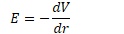
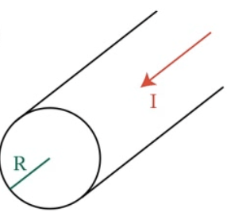
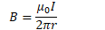
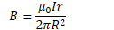
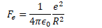
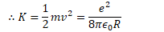
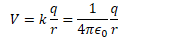
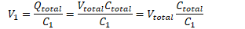

# Question 47

  -  

  -  ∴ The greatest force happens at the greatest
     E.

  -  

  -  ∴ The greatest E happens at the greatest slope the
 graph

 

# Question 50

 

# Question 52

 

1.   Find the magnetic field outside a current-carrying
     wire

<!-- end list -->

  -  

  -  

  -  

<!-- end list -->

1.   Find the magnetic field inside a current-carrying
     wire

<!-- end list -->

  -  

  -  

  -  

# Question 55

  -  

  -  

  -  

  -  

# Question 63

  -  

# Question 65

  -  

# Question 70

  -  When a dielectric is inserted between the plates of a capacitor,
     the capacitance increases.

 