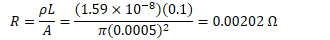

# Electric Current

  -  Electric current is the flow rate of electric charge
    
      -  Units are C/s, or amperes (A)
    
      -  Positive current flow is the direction of the flow of positive
         charges, which is opposite the direction of electron
     flow

  -  

# Drift Velocity

  -  In a conductor, electrons are inconstant thermal motion.

  -  Net electron flow, however, is zero because the motion is random

  -  When an electric field is applied, a small net flow in a direction
     opposite the electric field is
     observed

  -  

# Derivation of Current Flow

 
 
 

# Current Density

  -  

 
 
 ![f J.dS currenö region \[Total Current\] = Sum of Current Density
 over the region where the current flows ](./media/image237.png)

# Resistance

  -  Resistance is the ratio of the potential drop across an object to
     the current flowing through the object.

  -  Object which have a fixed resistance (not a function of current of
     potential drop) are known as Ohmic materials and are said to
     follow Ohm's Law (an empirical law)

 

# Resistance of a Wire

  -  The resistance of a wire depends on the geometry of the wire as
     well as a material property known as resistivity ⍴ (Unit: Ω·m)

  -  Resistivity relates to the ability of a material to resist the
     flow of electrons

 

# Refining Ohm's Law

  -  

  -  

  -  

  -  

# Conversion of Electric Energy to Thermal Energy

  -  

  -  

  -  

# Example 1: Silver Wire

  -  

<!-- end list -->

1.   Determine the resistance of the
         wire
    
      -  

2.   Determine the current flowing through the
         wire
    
      -  

3.   Determine the drift velocity of the free electrons in the wire
     (assume one free electron per
         atom)
    
      -  
    
      -  
    
      -  

4.   Determine the average time required for electrons to pass from the
     negative terminal of the battery to the positive
         terminal
    
      -  

# Example 2: Aluminum Wire

  -  

  -  