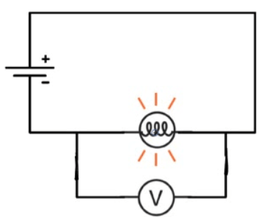
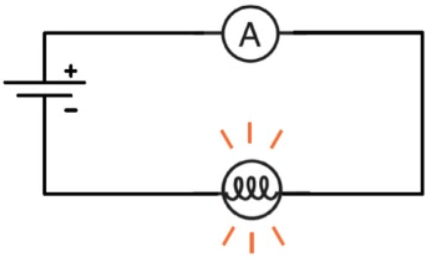
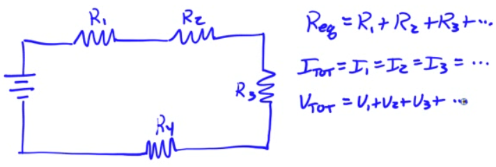
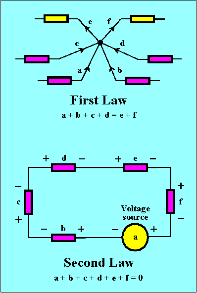

# Electrical Circuits

  -  An electrical circuit is a closed-loop path through which current
     can flow

  -  An electrical circuit can be made up of most any materials but
     practically speaking, circuits are typically comprised of
     electrical devices
    
      -  Wires
    
      -  Batteries
    
      -  Resistors
    
      -  Switches

  -  Conventional current flows from high potential to low potential

# Voltmeters

  -  Voltmeters measure the potential difference between two points in
     a circuit

  -  Voltmeters are connected in parallel with the element to be
     measured

  -  If a voltmeter is connected correctly, you can remove it from the
     circuit without breaking the circuit

  -  Voltmeters have very high
 resistance

 

# Ammeters

  -  Ammeters measure the current flowing through an element of a
     circuit

  -  Ammeters are connected in series with the circuit, so that the
     current to be measured flows through the ammeter

  -  The circuit must be broken to correctly insert an ammeter

  -  Ammeters have very low resistance to minimize the potential drop
     through the
 ammeter

 

# Series Circuits

  -  Series circuits have only a single current path

  -  Removal of any circuit element causes an open circuit

 

# Kirchhoff's Laws

  -  Kirchhoff's Laws are tools utilized in analyzing circuits

  -  Kirchhoff's Current Law (KCL) states that the sum of all current
     entering any point in a circuit equals the sum of all current
     leaving any point in a circuit
    
      -  Restatement of conservation of charge
    
      -  aka "Junction Rule"

  -  Kirchhoff's Voltage Law (KVL) states that the sum of all the
     potential drops in any closed loop of a circuit has to equal zero
    
      -  Restatement of conservation of energy
    
      -  aka "Loop Rule"

 