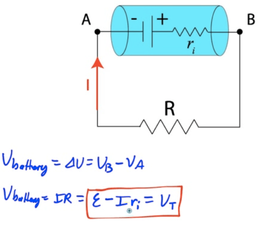

# Parallel Circuits

  -  Parallel Circuits have multiple current paths

  -  Removal of a circuit element may allow other branches of the
     circuit to continue
 operating

 

# Combination Series-Parallel Circuits

  -  A circuit doesn't have to be completely serial or parallel

  -  First, look for portions of the circuit with parallel elements.

  -  Replace parallel resistors with an equivalent single resistor

  -  Work back to original circuit using KCL and KVL until you know the
     current, voltage, and resistance of each individual circuit
     element

  -  Often times will lead to systems of equations to solve

# Example 1: Two Voltage Sources

  -  Find the current flowing through R3 if R3 has a value of 6 ohms.
     What is the power dissipated in R3?

 

# Batteries

  -  A cell or battery (combination of cells) provides a potential
     difference, oftentimes referred to as an electromotive force or
     emf.

  -  A battery can be thought of as a pump for charge, raising it from
     a lower potential to a higher potential

  -  Ideal batteries have no
     resistance

  -  

  -  In real batteries, the terminal voltage is slightly lower than the
     battery's
 emf

 

# Ideal Battery

 

# Real Battery

 