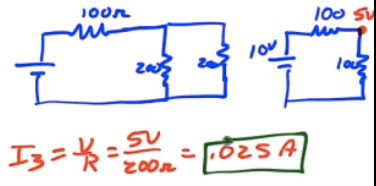
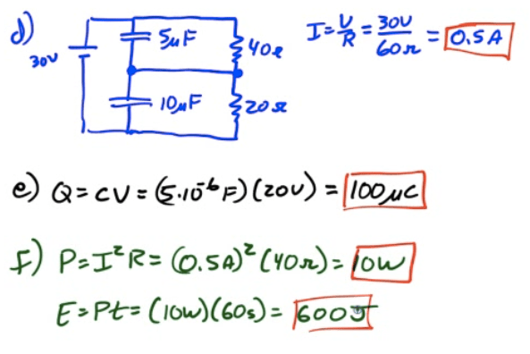

# Capacitors in Parallel

  -  Capacitors store charge on their plates

  -  Capacitors in parallel can be replaced with an equivalent
     capacitor

  -  

# Capacitors in Series

  -  Charge on capacitors must be the same

  -  Capacitors in series replaced with an equivalent
     capacitor

  -  

# RC Circuits

  -  RC Circuits are circuits comprised of a source of potential
     difference, a resistor network, and one or more capacitors

  -  We will look at RC circuits from the steady-state perspective
    
      -  What happens when first turned on
    
      -  What happens after a "long" time has elapsed

  -  Key to understanding RC Circuit Performance
    
      -  Uncharged capacitors act like wires
    
      -  Charged capacitors act like opens

# Charging an RC Circuit

 
 
 
 
 

# Discharging an RC Circuit

 
 
 
 
 

# The Time Constant

  -  

  -  

 

# Example 1: RC Analysis

 

  -  What is the current through R2 when the circuit is first
     connected?

 

  -  What is the current through R2 a long time after the circuit has
     been
 connected?

 

# Example 2: More RC Analysis

 

  -  What is the current through R3 when the circuit is first
     connected?

 

  -  What is the current through R2 a long time after the circuit has
     been
 connected

 

# Example 3: Equivalent Capacitance

  -  What is the equivalent capacitance of the capacitor network shown
     below?

 

# Example 4: More Equivalent Capacitance

  -  What is the equivalent capacitance of the capacitor network shown
     below?

 

# 2010 Free Response Question 2

 ![40 Q 5.0 10 20 Q 30 v In the circuit illustrated above, switch S is
 initially open and the battery has been connected for a long time. (a)
 What is the steady-state current through the ammeter? (b) Calculate
 the charge on the 10 PF capacitor. (c) Calculate the energy stored in
 the 5.0 PF capacitor. The switch is now closed, and the circuit comes
 to a new steady state. (d) Calculate the steady-state current through
 the battery. (e) Calculate the final charge on the 5.0 gF capacitor.
 (f) Calculate the energy dissipated as heat in the 40 Q resistor in
 one minute once the circuit has reached steady state.
 ](./media/image285.png)
 
 
 
 

# 2004 Free Response Question 2

 ![20 v — E\&M. 2. 15kQ c 20 14 12 8 6 2 0 5 10 Time (s) 15 In the
 circuit shown above left, the switch S is initially in the open
 position and the capacitor C is initially uncharged. A voltage probe
 and a computer (not shown) are used to measure the potential
 difference across thc capacitor as a function of time after the switch
 is closed. The graph produced by the computer is shown above right.
 The battery has an emf of 20 V and negligible internal resistance.
 Resistor RI has a resistance of 15 kQ and the capacitor C has a
 capacitance of 20 gF. (a) (b) (c) (d) Determine the voltage across
 resistor R2 immediately after the switch is closed. Determine the
 voltage across resistor R2 a long time after the switch is closed.
 Calculate the value of the resistor R2. Calculate the energy stored in
 the capacitor a long time after the switch is closed.
 ](./media/image288.png)
 
 
 
 ![(e) On the axes below, graph the current in R2 as a function of time
 from 0 to 15 s. Label the vertical axis with appropriate values. - -h
 F + - -l -l - --4---L--lr-- Current in R2 10 15 Time (s) Resistor R2
 is removed and replaced with another resistor of lesser resistance.
 Switch S remains closed for a long time. (D Indicate below whether the
 energy stored in the capacitor is greater than, less than, or the same
 as it was with resistor R2 in the circuit. Greater than Explain your
 reasoning. Less than The same as
 ](./media/image290.png)
 
 