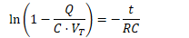
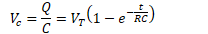
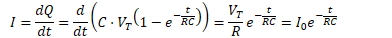
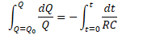
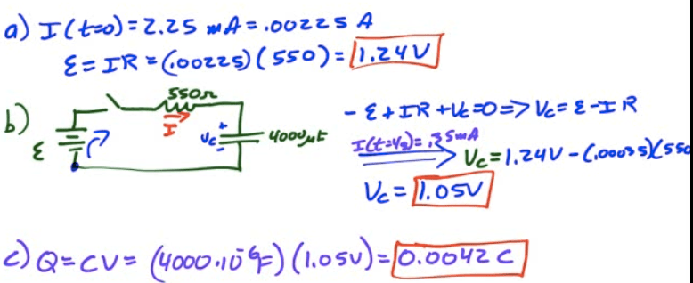

# Charging an RC Circuit

 

  -  

  -  

  -  

  -  

  -  

  -  

  -  

  -  

  -  

  -  

# Discharging an RC Circuit

 

  -  

  -  

  -  

  -  

  -  

  -  

  -  

  -  

  -  

  -  

# 2013 Free Response Question 2

 ![c In a lab, you set up a circuit that contains a capacitor C, a
 resistor R, a switch S, and a power supply, as shown in the diagram
 above. The capacitor is initially uncharged. The switch, which is
 initially open, can be moved to positions A or B. (a) i. Indicate the
 position to which the switch should be moved to charge the capacitor.
 ii. On the diagram, draw a voltmeter that is properly connected to the
 circuit in a manner that will allow the voltage to be measured across
 the capacitor. After a long time you move the switch to discharge the
 capacitor, and your lab partner starts a stopwatch. You collect the
 following measurements of the voltage across the capacitor at various
 times. 6 252 18 74 30 33 42 10 54 6 You wish to determine the time
 constant T of the circuit from the slope of a linear graph. (b) .
 Indicate two quantities you would plot to obtain a linear graph. ii.
 Use the remaining rows in the table above, as needed, to record any
 quantities that you indicated that are not given. Label each row you
 use and include units.
 ](./media/image314.png)
 
 
 
 ![(c) On the axes below, graph the data from the table that will
 produce a linear relationship. Clearly scale and label all axes
 including units, if appropriate. Draw a straight line that best fits
 your data points. cru -J \_J 4 4.-4 4. 4 4. 4. (d) From your line in
 part (c), obtain the value of the time constant T of the circuit. (e)
 . In the experiment, the capacitor C had a capacitance of 1.50 gF.
 Calculate an experimental value for the resistance R. ii. On the axes
 in part (c), use a dashed line to sketch a possible graph if the
 capacitance was greater than 1.50 gF but the resistance R was the
 same. Justify your answer. ](./media/image316.png)
 
 

# 2012 Free Response Question 2

 ![0.02 ml Paper Strip A physics student wishes to measure the
 resistivity of slightly conductive paper that has a thickness of 1.0 x
 10-4 m . The student cuts a sheet of the conductive paper into strips
 of width 0.02 m and varying lengths, making five resistors labeled RI
 to R5. Using an ohmmeter, the student measures the resistance of each
 strip, as shown above. The data are recorded below. Resistor Length
 (m) Resistance ( Q ) RI 0.020 80,000 0.040 180,000 0.060 260,000 0.080
 370,000 0.100 440,000 (a) Use the grid below to plot a linear graph of
 the data points from which the resistivity of the paper can be
 determined. Include labels and scales for both axes. Draw the straight
 line that best represents the data. (b) Using the graph, calculate the
 resistivity of the paper. ](./media/image318.png)
 
 
 
 ![Capacitor R4 Switch Battery The student uses resistors R4 and R5 to
 build a circuit using wire, a 1.5 V battery, an uncharged 10 BF
 capacitor, and an open switch, as shown above. (c) Calculate the time
 constant of the circuit. (d) At time t = 0, the student closes the
 switch. On the axes below, sketch the magnitude of the voltage Vc
 across the capacitor and the magnitudes of the voltages VR4 and VR5
 across each resistor as functions of time t. Clearly label each curve
 according to the circuit element it represents. On the axes,
 explicitly label any intercepts, asymptotes, maxima, or minima with
 values or expressions, as appropriate. Time t ](./media/image320.png)
 
 

# 2007 Free Response Question 1

 ![Switch R = 550 Q C = 4000gF A student sets up the circuit above in
 the lab. The values of the resistance and capacitance are as shown,
 but the constant voltage E delivered by the ideal battery is unknown.
 At time t = 0, the capacitor is uncharged and the student closes the
 switch. The current as a function of time is measured using a computer
 system, and the following graph is obtained. 2.5 2.0 1.0 0.5 O 2 4 6
 lime (s) 8 10 Using the data above, calculate the battery voltage E .
 (a) (b Calculate the voltage across the capacitor at time t = 4.0 s.
 Calculate the charge on the capacitor at t = 4.0 s. (c)
 ](./media/image322.png)
 
 
 
 ![(d) On the axes below, sketch a graph of the charge on the capacitor
 as a function of time. 10 Time (s) (e) Calculate the power being
 dissipated as heat in the resistor at t = 4.0 s. (f) The capacitor is
 now discharged, its dielectric of constant K = 1 is replaced by a
 dielectric of constant K = 3 , and the procedure is repeated. Is the
 amount of charge on one plate of the capacitor at t = 4.0 s now
 greater than, less than, or the same as before? Justify your answer.
 Greater than Less than The same ](./media/image324.png)
 
 

# 2006 Free Response Question 2

 ![c The circuit above contains a capacitor of capacitance C, a power
 supply of emf e , two resistors of resistances RI and R2 , and two
 switches, Sl and S2 . Initially, the capacitor is uncharged and both
 switches are open. Switch Sl then gets closed at time t = O. (a) Write
 a differential equation that can be solved to obtain the charge on the
 capacitor as a function of time t. (b) Solve the differential equation
 in part (a) to determine the charge on the capacitor as a function of
 time t. Numerical values for the components are given as follows: e =
 12 v C = 0.060 F RI = = 4700 Q (c) Determine the time at which the
 capacitor has a voltage 4.0 V across it. After switch Sl has been
 closed for a long time, switch S2 gets closed at a new time t = O.
 ](./media/image326.png)
 
 
 
 
 
 

# 2003 Response Question 2

 ![In the laboratory, you connect a resistor and a capacitor with
 unknown values in series with a battery of emf E = 12 V . You include
 a switch in the circuit. When the switch is closed at time t = 0, the
 circuit is completed, and you measure the current through the resistor
 as a function of time as plotted below. 0.010 0.005 4 8 12 16 e e-t/4
 A data-fitting program finds that the current decays according to the
 equation i(t) = (a) Using common symbols for the battery, the
 resistor, the capacitor, and the switch, draw the circuit that you
 constructed. Show the circuit before the switch is closed and include
 whatever other devices you need to measure the current through the
 resistor to obtain the above plot. Label each component in your
 diagram. (b) Having obtained the curve shown above, determine the
 value of the resistor that you placed in this circuit. (c) What
 capacitance did you insert in the circuit to give the result above?
 ](./media/image330.png)
 
 
 
 ![You are now asked to reconnect the circuit with a new switch in such
 a way as to charge and discharge the capacitor. When the switch in the
 circuit is in position A, the capacitor is charging; and when the
 switch is in position B, the capacitor is discharging, as represented
 by the graph below of voltage Vc across the capacitor as a function of
 time. Vc(V) Switch at A Charging 12 6 4 8 12 Switch at B Discharging
 16 20 24 28 32 (d) Draw a schematic diagram of the RC circuit that you
 constructed that would produce the graph above. Clearly indicate
 switch positions A and B on your circuit diagram and include whatever
 other devices you need to measure the voltage across the capacitor to
 obtain the above plot. Label each component in your diagram.
 ](./media/image332.png)
 
 