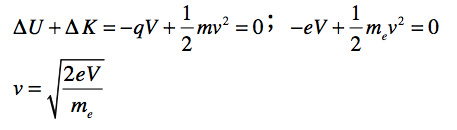
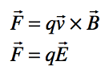

# Question 43

 
 
 

# Question 51

 
 
 ![Forces between two parallel infinitely long current-carrying
 conductors: Magnetic Field on RS due to current in PQ is (in
 magnitude) 27T r Force acting on RS due to current 12 through it is 12
 12 1 sin 90' or — 27T r 27T r B acts perpendicular and into the plane
 of the diagram by Right Hand Thumb Rule. So, the angle between I and
 Bl is 90 • . is length of the conductor. Magnetic Field on PQ due to
 current in RS is (in magnitude) 2TT r Force acting on PQ due to
 current l, through it is po 12 l, sin 90' or = 27 r 1,121 2TT r Force
 per unit length of the conductor is 27 r (The angle between I and B2
 is 90 • and B2 Is emerging out) 2TT r ](./media/image554.png)

# Question 53

 
 
 
 
 

# Question 58

 
 
 
 
 

# Question 65

 
 
 

# Question 69

 ![1 11 111 39. When a negatively charged rod is brought near, but does
 not touch, the initially uncharged electroscope shown above, the
 leaves spring apart (I). When the electroscope is then touched with a
 finger, the leaves collapse (Il). When next the finger and finally the
 rod are removed, the leaves spring apart a second time (Ill). The
 charge on the leaves is (B) C D (E) positive in both I and Ill
 negative in both I and Ill ositive in I ne ative in Ill ne ative in I
 sitive in Ill impossible to determine in either I or Ill
 ](./media/image563.png)
 
 

# Question 70

 ![x x x PI x x x Copper x x x P2 x x x -e 'O. A sheet of copper in the
 plane of the page is connected to a battery as shown above, causing
 electrons to drift through the copper toward the bottom of the page.
 The copper sheet is in a magnetic field B directed into the page. PI
 and P2 are points at the edges of the strip. Which of the following
 statements is true? (A) PI is at a higher potential than P2. (B) P2 is
 at a higher potential than Pl. (C) PI and P2 arc at equal positive
 potential. (D) PI and P2 are at equal negative potential. (E) Current
 will cease to flow in the copper sheet. ](./media/image565.png)
 
 