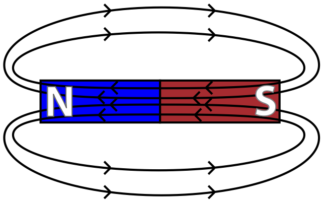
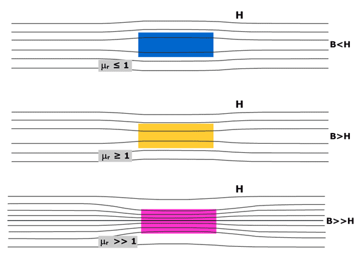

# Magnetism

  -  Magnetism is a force caused by moving charges

  -  Magnets are dipoles (they have a north and a south)

  -  Like poles repel, opposite poles attract

  -  Magnetic domains are clusters of atoms with electrons spinning in
     the same direction
    
      -  Random domains: no net magnetic field
    
      -  When many of the domains line up, you get a net magnetic
         field, creating a strong magnet

 

# Magnetic Fields

  -  
    
      -  Units a Tesla (T)

  -  Magnets are polarized (each has two opposite ends)
    
      -  End of a magnet that points toward the geographic north pole
         of the Earth is called the north pole of the magnet
    
      -  There are no magnetic monopoles

# Magnetic Field Lines

  -  Magnetic Field Lines make closed loops and run from north to south
     outside the magnet
    
      -  Magnet field lines show the direction the north pole of a
         magnet would tend to point if placed in the
     field

  -  

 

# The Compass

  -  The Earth is a giant magnet

  -  The Earth's magnetic north pole is located near the geographic
     south pole, and vice versa
    
      -  A compass's north magnet pole points toward the Earth's
         magnetic south pole (geographic north)

  -  A compass lines up with the net magnetic field

 

# Magnetic Permeability

  -  Magnetic permeability refers to the ratio of magnetic field
     strength induced in a material to the magnetic field strength of
     the induced
 field

 

  -  Free space has a constant value of magnetic permeability that
     appears in physical
 relationships

 

  -  The permeability of matter has a value different from that of free
     space

  -  Highly magnetic materials (such as iron) have higher values of
     magnetic permeability

# Magnetic Dipole Moment

  -  The magnetic dipole moment of a magnet refers to the force that a
     magnet can exert on moving charges

  -  Can be thought of in simplistic terms as the relative strength of
     a magnet
    
      -  Compare the magnetic dipole moment of a hydrogen atom to the
         magnetic dipole moment of a highly magnetized iron bar
    
      -  Fe > H

 