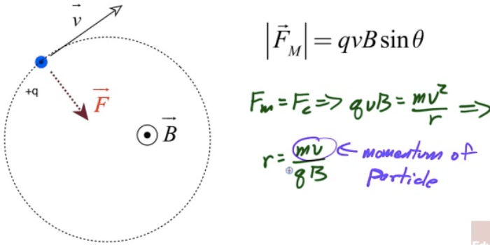
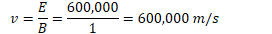

# Magnetic Fields

  -  

  -  

  -  1 Tesla is a very strong magnetic field

  -  More common non-SI units is the
     Gauss

  -  

  -  Earth's magnetic field strength ≈ 0.5 Gauss

# Forces on Moving Charges

  -  The magnetic force is always perpendicular to the charged object's
     velocity, therefore the magnetic force on a moving charge is never
     applied in the direction of the displacement, therefore a magnetic
     force can do no work on a moving charge (but it can change its
     direction)

  -  

  -  

 

# Direction of the Magnetic Force

  -  Direction of the force given by right-hand rule
    
      -  Point fingers of right hand in direction of positive
         particles' velocity
    
      -  Curl fingers inward in the direction of the magnetic field
    
      -  Thumb points in the direction of the force on charged particle

 

# Path of Charged Particles in B Fields

  -  Magnetic force cannot perform work on a moving charge

  -  Magnetic force can change its direction (moving it in a circle if
     the magnetic force is constant)

 

# Total Force on a Moving Charged Particle

  -  E field can do work on a moving charge

  -  B filed can never do work on a moving charge

  -  Lorentz Force

 

# Velocity Selector

  -  A charged particle in crossed E and B fields can undergo constant
     velocity motion is v, B, and E are all selected perpendicular to
     each
     other

  -  

 
 
 

# Mass Spectrometer

  -  Magnetic fields accelerate moving charges so that they travel in a
     circle

  -  This can be used to determine the mass of an unknown particle\!

 

# Example 1: Velocity Selector 

  -  Find the speed of a charged particle which passes through a
     velocity selector with magnetic field strength of 1 Tesla
     perpendicular to an electric field of 600,000
     N/C

  -  

  -  

  -  

# Example 2: Mass Spectrometer

 

  -  A proton is accelerated through a potential difference V before
     passing into a region of uniform magnetic field B as shown

<!-- end list -->

1.   Determine the voltage necessary to give the proton a speed v as it
     enters the magnetic field region in terms of the proton's mass m,
     its velocity v, and its charge,
         q.
    
      -  
    
      -  

2.   Determine an expression for the radius of the proton's motion in
     the uniform magnetic field
         region
    
      -  
    
      -  

<!-- end list -->

1.   Sketch the path of the proton in the magnetic field

 

1.   An electric field is applied in the same region as the uniform
     magnetic field. Determine the magnitude and direction of electric
     field required so that the proton passes through the region in a
     straight line
    
      -  
    
      -  
    
      -  