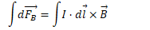

# Forces on Current-Carrying Wires

  -  Moving charges in magnetic fields experience forces.

  -  Current in a wire is just a flow of charges.

  -  If charges are moving perpendicular to magnetic fields, they
     experience a force which is applied to the
 wire.

 
 
 
 
 
 
 
 
 
 
 
 
 
 
 
 
 
 
 

# Example 1: Current Through a Wire

 

  -  A straight wire of length 1 m carries a current of 100 A through a
     magnetic field of 1 Tesla. Find the force on the
     wire

  -  

# Electric Motors

 

# Example 2: Net Torque

  -  Determine the direction of the net torque on the current-carrying
     closed
 circuit

 

# Example 3: Force on a Curved Wire

 

  -  The curved wire carries constant current I through a uniform
     magnetic field B as shown. Find the net force acting on the
     wire.

  -  

  -  