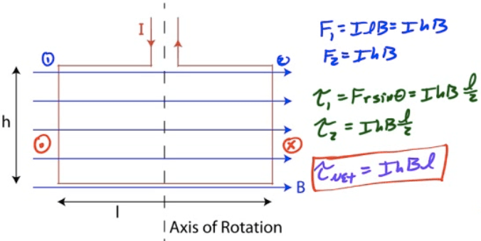
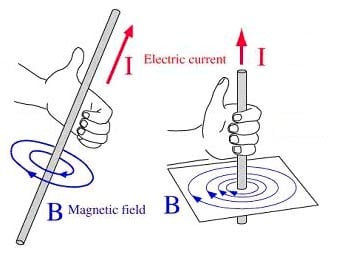
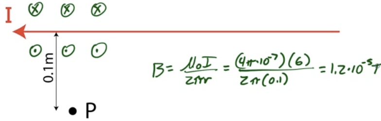
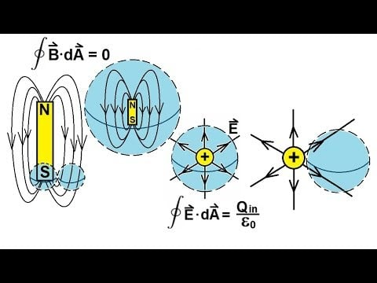
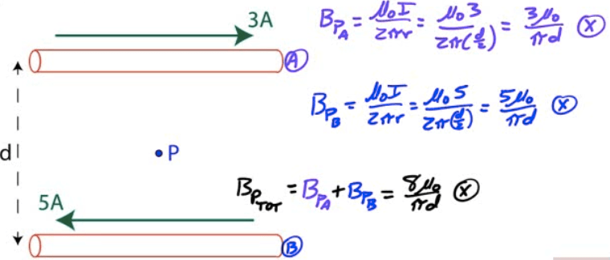
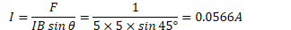

# Example 1: Torque on a Loop of Wire

  -  A loop of wire carrying current I is placed in a magnetic field.
     Determine the net torque around the axis of rotation due to the
     current in the wire.

 

# Magnetic Field due to a Current-Carrying Wire

  -  Moving charges create magnetic fields

  -  Current-carrying wires carry moving charges, therefore they create
     B fields

  -  Direction given by right-hand rule

  -  For multiple wires, determine B field from each and add them up
     using superposition

  -  B fields may interact with other moving charges, so
     current-carrying wires can exert forces upon each other.

# First Right Hand Rule

 

  -  "Hold" wire with your right hand, thumb in direction of positive
     current flow

  -  Your fingers wrap in the direction of the magnetic
     field

  -  

  -  

# Example 2: Magnetic Field due to a Wire

  -  A wire carries a current of 6 amperes to the left.

  -  Find the magnetic field at point P, located 0.1 meters below the
     wire

 

# Force Between Parallel Current-Carrying Wires

  -  Use right hand rules to determine force between parallel
     current-carrying wires

  -  Find magnetic field due to first wire. Draw it.

  -  Find direction of force on second wire due to current in second
     wire. Force on the first wire will be equal and opposite (Newton's
     third Law)

 

# Gauss's Law for Magnetism

  -  You can never draw a closed surface with any net magnetic flux
     because there are no magnetic monopoles.

  -  This is the basis of Gauss's Law for Magnetism (Maxwell's second
     equation)

  -  

 

# Example 3: Field due to Wires

  -  Two long current-carrying wires are separated by a distance d as
     shown.

  -  What is the net magnetic field due to these wires at point P,
     located midway between the two wires, if the top wire carries a
     current of 3A and the bottom wire caries a current of 5A.

  -  

# Example 4: Force on a Wire

  -  A 5-m long straight wire runs at a 45-degree angle to a uniform
     magnetic field of 5 T. If the force on the wire is 1N, determine
     the current in the
     wire

  -  

  -  

# 2009 Free Response Question 2

 ![5.0 x 10-61112 9.0 v A 9.0 V battery is connected to a rectangular
 bar of length 0.080 m, uniform cross-sectional area 5.0 x 10 m and
 resistivity 4.5 x 10 , as shown above. Electrons are the sole charge
 carriers in the bar. The wires have negligible resistance. The switch
 in the circuit is closed at time t = O . (a) Calculate the power
 delivered to the circuit by the battery. (b) On the diagram below,
 indicate the direction of the electric field in the bar. b Side View
 Explain your answer. (c) Calculate the strength of the electric field
 in the bar. A uniform magnetic field of magnitude 0.25 T perpendicular
 to the bar is added to the region around the bar, as shown below. 5.0
 x 10-61112 x a X X 9.0 v 0.25 T (d) Calculate the magnetic force on
 the bar. X X X x x X X X x X X X X X X X x X X X x X X X X x X x X b x
 X Side View ](./media/image393.png)
 
 ![Eş\!\!\] z 72-2 z : 3 (2 u 22 91 • S • ](./media/image394.png)
 
 
 
 