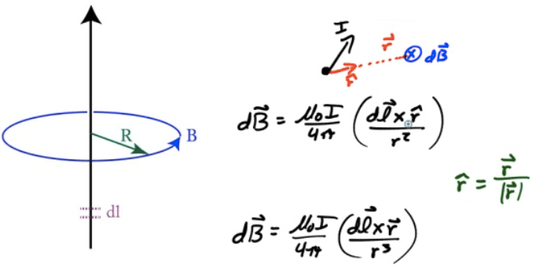
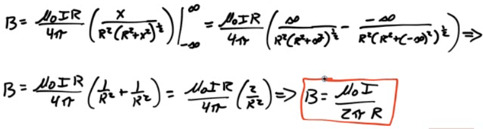

# Biot-Savart Law

  -  A "brute force" method of finding the magnetic field due to a
     length of current-carrying
 wire

 

# Example 1: Magnetic Field due to a Current Loop

  -  Derive the magnetic field due to a current loop at the center of
     the loop

 

# Example 2: Magnetic Field due to Long Straight Current-Carrying Wire

  -  Derive the magnetic field strength at a point P located a distance
     R from an infinitely long current-carrying wire using the
     Biot-Savart
 Law

 
 
 

# Example 3: Magnetic Field due to A Current Loop

  -  Derive the magnetic field due to a current loop at a point out of
     the plane of the loop but centered on the loop's axis as
 shown

 
 
 