# Ampere's Law

  -  Ampere's Law provides an elegant method of finding the magnetic
     field due to current flowing in a wire in situations of planar and
     cylindrical
 symmetry

 
 
 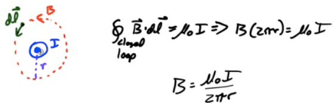

# Example 1: Magnetic Field of a Wire

 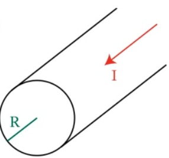

1.   Find the magnetic field outside a current-carrying
     wire

<!-- end list -->

  -  

  -  

  -  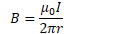

<!-- end list -->

1.   Find the magnetic field inside a current-carrying
     wire

<!-- end list -->

  -  

  -  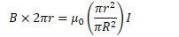

  -  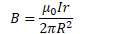

<!-- end list -->

1.   Graph the magnetic field of a current-carrying wire as a function
     of the distance from the center of the
 wire

 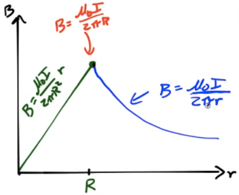

# Example 2: Magnetic Field in a Solenoid

 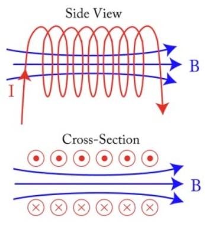

  -  Calculate the magnetic field in the middle of a solenoid (i.e.
     Slinky) using Ampere's
     Law

  -  

  -  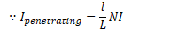

  -  

  -  

# Example 3: Net Force on a Wire Loop

  -  

  -  What is the direction of the net force on the
 loop?

 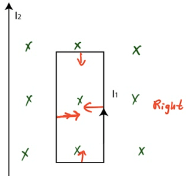

# 2011 Free Response Question 3

 ![b a Cross-sectional View (current into page) E\&M. 3. A section of a
 long conducting cylinder with inner radius a and outer radius b
 carries a current 10 that has a uniform current density, as shown in
 the figure above. (a) Using law, derive an expression for the
 magnitude of the magnetic field in the following regions as a function
 of the distance r from the central axis. i. ii. iii. r = 2b (b) On the
 cross-sectional view in the diagram above, indicate the direction of
 the field at point P, which is at a distance r = 2b from the axis of
 the cylinder. (c) An electron is at rest at point P. Describe any
 electromagnetic forces acting on the electron. Justify your answer.
 ](./media/image418.png)
 
 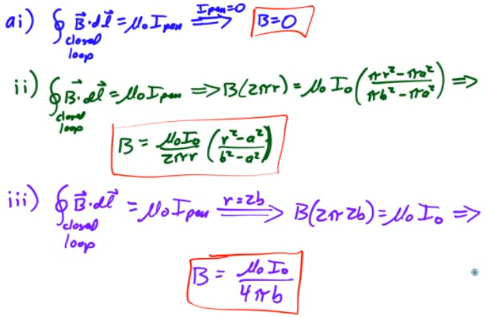
 
 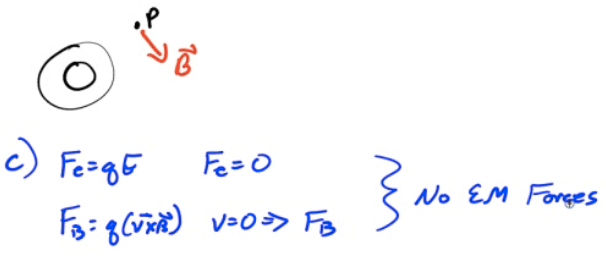
 
 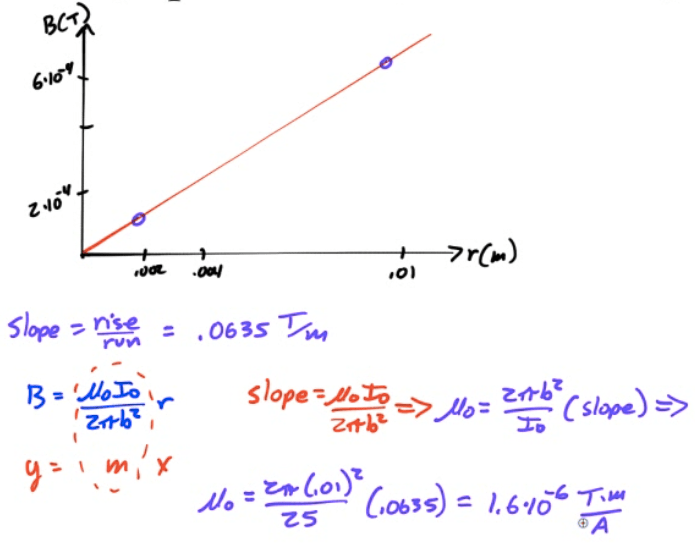

# 2005 Free Response Question 3

 ![Hall Probe and Meter 0 10 20 30 40 50 60 70 80 90 100 A student
 performs an experiment to measure the magnetic field along the axis of
 the long, 100-turn solenoid PQ shown above. She connects ends P and Q
 of the solenoid to a variable power supply and an ammeter as shown.
 End P of the solenoid is taped at the 0 cm mark of a meterstick The
 solenoid can be stretched so that the position of end Q can be varied.
 The student then positions a Hall probe\* in the center of the
 solenoid to measure the magnetic field along its axis. She measures
 the field for a fixed current of 3.0 A and various positions of the
 end Q. The data she obtains are shown below. Trial Position of End Q
 Measured Magnetic Field (T) n (turns/m) 1 2 3 4 5 (cm) 40 50 60 80 100
 (directed from P to Q) \_4 9.70 x 10 —4 7.70 x 10 \_4 6.80 x 10 \_4
 4.90 x 10 -4 4.00 x 10 (a) Complete the last column of the table above
 by calculating the number of turns per meter. \*A Hall Probe is a
 device used to measure the magnetic field at a point.
 ](./media/image422.png)
 
 
 
 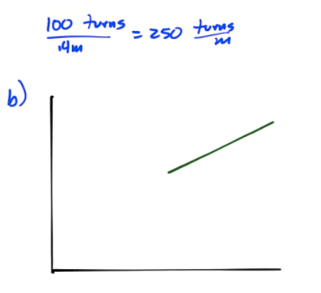
 
 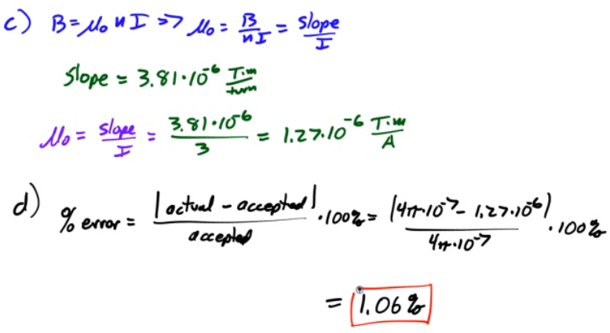