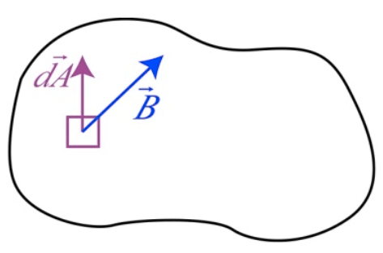
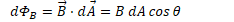
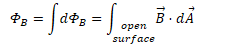
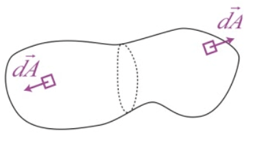
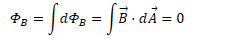
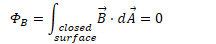
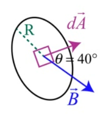
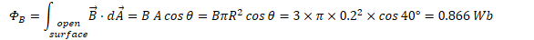
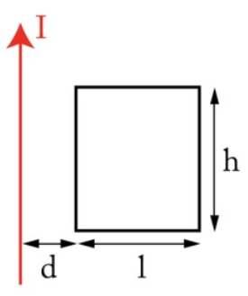
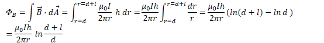

# Magnetic Flux

  -  

  -  Units of magnetic flux are Weber
     (Wb)

  -  

 

  -  

  -  

# Magnetic Flux Through Closed Surfaces

  -  Normal to closed surfaces point from the inside to the
 outside

 
 
 

# Gauss's Law for Magnetism

  -  The total magnetic flux through any closed surface is zero

  -  This would not be true if magnetic monopoles were found to
     exist

  -  

# Example 1: Flux through a Circular Loop

 

  -  Calculate the flux of 3-Tesla uniform magnetic field through the
     circular loop of radius 0.2 meters with three turns of
     wire

  -  

# Example 2: Flux Due to a Wire

 

  -  A long straight wire carries a current I as shown.

  -  Calculate the magnetic flux through the
     loop

  -  