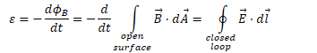
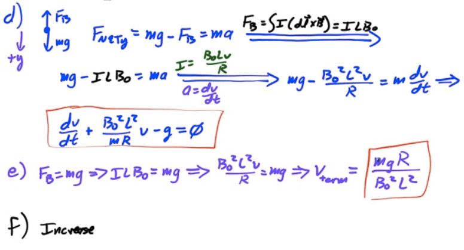
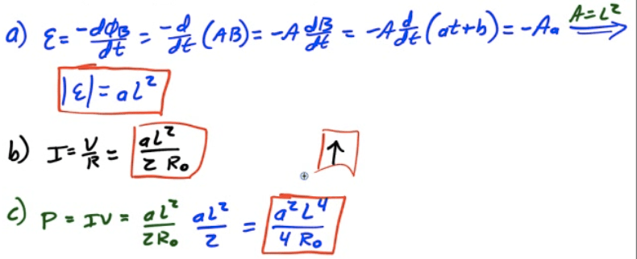
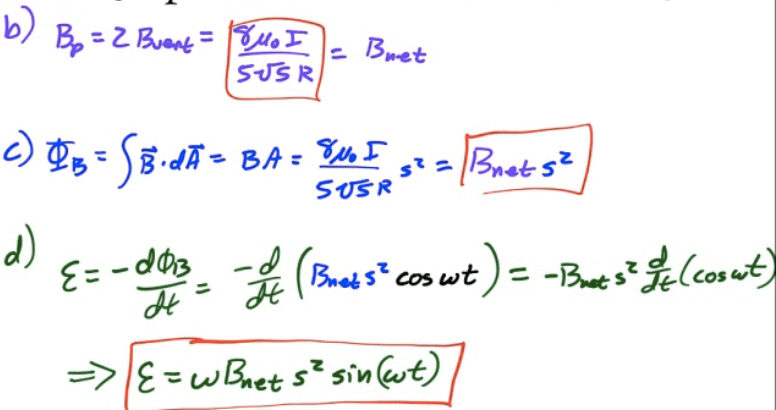
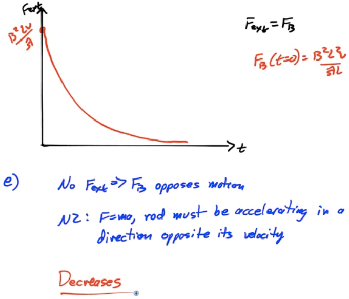
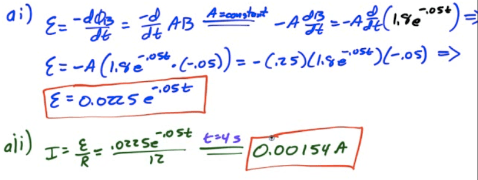

# Faraday's Law

  -  The induced emf due to a changing magnetic field is equal in
     magnitude to the rate of change of the magnetic flux through a
     surface bounded by the circuit

  -  The direction of the induced current is given by Lenz's
     Law

  -  

 

# Lenz's Law

  -  The current induced by a changing magnetic flux creates a magnetic
     field opposing the change in
 flux

 

# Maxwell's Equations

 

# Example 1: Induced Current in a Loop

 

  -  

<!-- end list -->

1.   Find the generated emf as a function of
         time
    
      -  

2.   Determine the current through the 100-ohm lamp as a function of
     time
    
      -  

3.   What is the direction of the current through the loop at time
     t=5s?
    
      -  
    
      -  Clockwise, due to Lenz's
 Law

# Example 2: Rod on Rails

 

  -  Consider a circuit in which a current-carrying rod on rails is
     moved to the left with constant velocity v. If the circuit is
     perpendicular to a constant magnetic field, determine the induced
     emf in the
     circuit

  -  

# 2012 Free Response Question 3

 ![Crossbar X x x x X X X X x x x x X X 130 X X x X x x x X x X x X x X
 x x x X X X X x X X x X X X X A closed loop is made of a U-shaped
 metal wire of negligible resistance and a movable metal crossbar of
 resistance R. The crossbar has mass m and length L It is initially
 located a distance ho from the other end of the loop. The loop is
 placed vertically in a uniform horizontal magnetic field of magnitude
 Bo in the direction shown in the figure above. Express all algebraic
 answers to the questions below in terms of Bo , L, m, ho , R, and
 fundamental constants, as appropriate. (a) Determine the magnitude of
 the magnetic flux through the loop when the crossbar is in the
 position shown. The crossbar is released from rest and slides with
 negligible friction down the U-shaped wire without losing electrical
 contact. (b) On the figure below, indicate the direction of the
 current in the crossbar as it falls. Justify your answer. (c)
 Calculate the magnitude of the current in the crossbar as it falls as
 a function of the crossbar's speed v . ](./media/image449.png)
 
 
 
 
 
 

# 2010 Free Response Question 3

 ![Lightbulb (resistance R) E\&M. 3. The long straight wire illustrated
 above carries a current I to the right. The current varies with time t
 according to the equation I = 10 — Kt , where 10 and K are positive
 constants and I remains positive throughout the time period of
 interest. The bottom of a rectangular loop of wire of width b and
 height a is located a distance d above the long wire, with the long
 wire in the plane of the loop as shown. A lightbulb with resistance R
 is connected in the loop. Express all algebraic answers in terms of
 the given quantities and fundamental constants. (a) Indicate the
 direction of the current in the loop. Clockwise Justify your answer.
 Counterclockwise (b) Indicate whether the lightbulb gets brighter,
 gets dimmer, or stays the same brightness over the time period of
 interest. Gets brighter Justify your answer. Gets dimmer Remains the
 same (c) (d) (e) Determine the magnetic field at t = O due to the
 current in the long wire at distance r from the long wire. Derive an
 expression for the magnetic flux through the loop as a function of
 time. Derive an expression for the power dissipated by the lightbulb.
 ](./media/image453.png)
 
 
 
 

# 2009 Free Response Question 3

 ![x x x x E\&M. 3. x x 2 x x A square conducting loop of side L
 contains two identical lightbulbs, 1 and 2, as shown above. There is a
 magnetic field directed into the page in the region inside the loop
 with magnitude as a function of time t given by B (t) = at + b , where
 a and b are positive constants. The lightbulbs each have constant
 resistance Ro . Express all answers in terms of the given quantities
 and fundamental constants. (a) (b) (c) Derive an expression for the
 magnitude of the emf generated in the loop. i. Determine an expression
 for the current through bulb 2. ii. Indicate on the diagram above the
 direction of the current through bulb 2. Derive an expression for the
 power dissipated in bulb 1. ](./media/image456.png)
 
 
 
 
 
 
 
 

# 2008 Free Response Question 3

 
 
 
 
 ![1 Figure 2 Axis Figure 3 A second identical loop also carrymg a
 current I is added at a distance of R above the first loop, as shown
 in Figure 2 above. (b) Determine the magnitude of the net magnetic
 field Bnet at point P. A small square loop of wire in which each side
 has a length s is now placed at point P with its plane parallel to the
 plane of each loop, as shown in Figure 3 above. For parts (c) and (d),
 assume that the magnetic field between the two circular loops is
 uniform in the region of the square loop and has magnitude B net • (c)
 In terms of Bnet and s, determine the magnetic flux through the square
 loop. (d) The square loop is now rotated about an axis in its plane at
 an angular speed O. In terms of Bnet , s, and o , calculate the
 induced emf in the loop as a function of time t, assuming that the
 loop is horizontal at t = O.
 ](./media/image463.png)
 
 

# 2007 Free Response Question 3

 ![x x x x x x x x x x x x x x x x x x x x x x x x x x Top View x x x x
 x x x x x x x x x x x x x x In the diagram above, a nichrome wire of
 resistance per unit length is bent at points P and Q to form
 horizontal conducting rails that are a distance L apart. The wire is
 placed within a uniform magnetic field of magnitude B pointing into
 the page. A conducting rod of negligible resistance, which was aligned
 with end PQ at time t = O, slides to the right with constant speed v
 and negligible friction. Express all algebraic answers in terms of the
 given quantities and fundamental constants. (a) Indicate the direction
 of the current induced in the circuit. Clockwise Justify your answer.
 Counterclockwise (b) Derive an expression for the magnitude of the
 induced current as a function of time t. (c) Derive an expression for
 the magnitude of the magnetic force on the rod as a function of time.
 ](./media/image465.png)
 
 
 
 
 
 

# 2006 Free Response Question 3

 ![Spring x x x x x x x x x x x x s x x x x Magnetic Field A loop of
 wire of width w and height h contains a switch and a battery and is
 connected to a spring of force constant k, as shown above. The loop
 carries a current I in a clockwise direction, and its bottom is in a
 constant, uniform magnetic field directed into the plane of the page.
 (a) On the diagram of the loop below, indicate the directions of the
 magnetic forces, if any, that act on each side the loop. (b) The
 switch S is opened, and the loop eventually comes to rest at a new
 equilibrium position that is a distance x from its former position.
 Derive an expression for the magnitude Bo of the uniform magnetic
 field in terms of the given quantities and fundamental constants.
 ](./media/image469.png)
 
 
 
 ![The spring and loop are replaced with a loop of the same dimensions
 and resistance R but without the battery and switch. The new loop is
 pulled upward, out of the magnetic field, at constant speed vo.
 Express algebraic answers to the following questions in terms of B D
 R, and the dimensions of the loop. (c) i. On the diagram of the new
 loop below, indicate the direction of the induced current in the loop
 as the loop moves upward. x x x x x x X x x x x x x x x x ii. Derive
 an expression for the magnitude of this current. (d) Derive an
 expression for the power dissipated in the loop as the loop is pulled
 at constant speed out of the field. (e) Suppose the magnitude of the
 magnetic field is increased. Does the external force required to pull
 the loop at speed vo increase, decrease, or remain the same? Increases
 Justify your answer. Remains the same ](./media/image471.png)
 
 

# 2013 Free Response Question 3

 ![x x x x x X x X x x x X x x x x x x x x x x x x x x x x x x x x x x
 x x x x x x x x The figure above shows a circular loop of area 0.25 m2
 and resistance 12 Q that lies in the plane of the page. A magnetic
 field of magnitude B directed into the page exists in the area of the
 loop. The field varies with time t, as shown in the graph below. 1.8
 1.2 - 0.6 o B = 1.8e-0.05r 4 8 12 16 18 (a) . Derive an expression for
 the magnitude of the induced emfin the loop as a function of time for
 the interval t = O s to t = 8 s. ii. Calculate the magnitude of the
 induced current I in the loop at time t = 4 s. ](./media/image473.png)
 
 
 
 
 
 