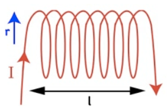

# Self-Inductance

  -  Self-inductance (L) is the ability of a circuit to oppose the
     magnetic flux that is produced by the circuit itself

  -  Running a changing current through a circuit creates a changing
     magnetic field, which creates an induced emf that fights the
     change

  -  Units are henrys (H)
    
      -  

  -  Self-inductance is purely a function of the circuit's
     geometry

# Calculating Self Inductance

  -  

  -  Ratio of magnetic flux to current
     flow

  -  

  -  For inductor:
    
      -  

  -  For capacitor:
    
      -  

# Example 1: Self Inductance of s Solenoid

 

  -  Calculate the self-inductance of a solenoid of radius r and length
     L with N
     windings

  -  

  -  

# Example 2: Calculating Self Inductance

  -  Calculate the self-inductance of a solenoid with 3400 turns of
     wire if the solenoid is 9 cm long and has a diameter of 11
     cm.

  -  

# Inductor, Capacitor, and Resistor

 
