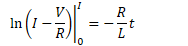
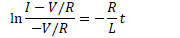
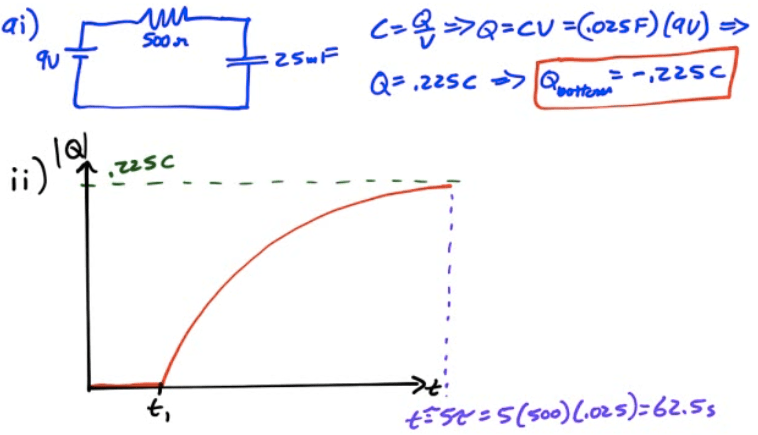
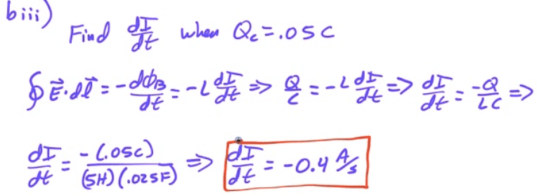
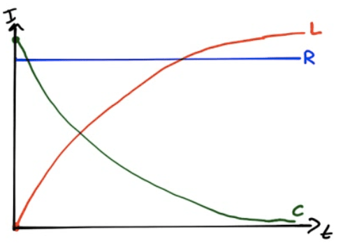

# Inductors in Circuits

  -  When circuit is first turned on, inductor opposes current flow and
     act like an open circuit

  -  After a time, inductor keeps current going and acts as a short

  -  After a long time, if the battery is removed, the inductor acts as
     an emf source to keep the current going

  -  As the resistor dissipates power, the current will decay
     exponentially to zero.

 

# Current in RL Circuits

  -  

  -  

  -  

  -  

  -  

  -  

  -  

  -  

  -  

  -  

# Voltage in RL Circuits

  -  

# Current and Voltage Graphs

 

# 2011 Free Response Question 2

 ![500 Q 9.0 V E\&M. 2. 25 5.0 H The circuit represented above contains
 a 9.0 V battery, a 25 mF capacitor, a 5.0 H inductor, a 500 Q
 resistor, and a switch with two positions, Sl and S2 . Initially the
 capacitor is uncharged and the switch is open. (a) In experiment 1 the
 switch is closed to position Sl at time ti and left there for a long
 time. i. Calculate the value of the charge on the bottom plate of the
 capacitor a long time after the switch is closed. ii. On the axes
 below, sketch a graph of the magnitude of the charge on the bottom
 plate of the capacitor as a function of time. On the axes, explicitly
 label any intercepts, asymptotes, maxima, or minima with numerical
 values or algebraic expressions, as appropriate.
 ](./media/image500.png)
 
 
 
 
 
 ![(b) In experiment 2 the capacitor is again uncharged when the switch
 is closed to position Sl at time ti . The switch is then moved to
 position S2 at time t2 when the magnitude of the charge on the
 capacitor plate is 105 mC, allowing electromagnetic oscillations in
 the LC circuit. i. Calculate the energy stored in the capacitor at
 time t2 . ii. Calculate the maximum current that will be present
 during the oscillations. iii. Calculate the time rate of change of the
 current when the charge on the capacitor plate is 50 mC.
 ](./media/image503.png)
 
 
 
 

# 2008 Free Response Question 2

 ![RI = 200 Q e=1500v — R3=100Q In the circuit shown above, A and B are
 terminals to which different circuit components can be connected. (a)
 Calculate the potential difference across R2 immediately after the
 switch S is closed in each of the following cases. i. A 50 Q resistor
 connects A and B. ii. A 40mH inductor connects A and B. iii. An
 initially uncharged 0.80 PF capacitor connects A and B. (b) The switch
 gets closed at time t = O . On the axes below, sketch the graphs of
 the current in the 100 Q resistor R3 versus time t for the three
 cases. Label the graphs R for the resistor, L for the inductor, and C
 for the capacitor.
 ](./media/image506.png)
 
 
 
 
 
 

# 2005 Free Response Question 2

 ![In the circuit shown above, resistors 1 and 2 of resistance RI and
 R2 , respectively, and an inductor of inductance L are connected to a
 battery of emf E and a switch S. The switch is closed at time t = O.
 Express all algebraic answers in terms of the given quantities and
 fundamental constants. (a) Determine the current through resistor 1
 immediately after the switch is closed. (b) Determine the magnitude of
 the initial rate of change of current, dl/dt , in the inductor. (c)
 Determine the current through the battery a long time after the switch
 has been closed. (d) On the axes below, sketch a graph of the current
 through the battery as a function of time. Current Time Some time
 after steady state has been reached, the switch is opened. (e)
 Determine the voltage across resistor 2 just after the switch has been
 opened.
 ](./media/image510.png)
 
 
 
 
 
 