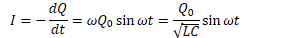

# LC Circuits

  -  When circuit is first turned on, assume capacitor is fully
     charged.

  -  Interplay of capacitor and inductor creates an oscillating system,
     modeled in similar fashion to
 SHM

# Charge in LC Circuits

 

  -  

  -  

  -  

  -  

  -  

  -  

  -  

  -  

# Current and Potential in LC Circuits

  -  

  -  

# Graphs of LC Circuits

 
 
 

  -  