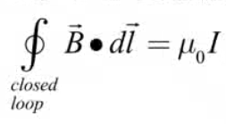
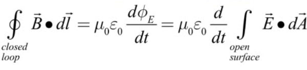
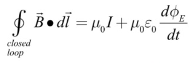

# Maxwell's Equations

 

# Revisiting Ampere's Law

  -  Ampere's Law as written allows us to calculate the magnetic field
     due to an electric current.

  -  We also know that a changing electric field produces a magnetic
     field

  -  Combine effects of electric current and changing E field on
     magnetic field to obtain a more complete version of Ampere's Law

  -  Contribution due to the penetrating current is known a conduction
     current.

 

  -  Contribution due to changing electric field is known as the
     displacement current

 

  -  Final Ampere's Law

 