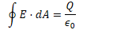
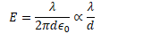
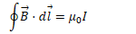
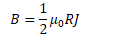
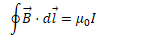
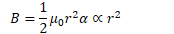
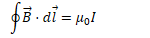
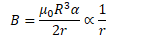
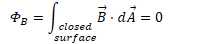

# Question 2

  -  Electric Field of a Uniformly Charged Wire

 

  -  

  -  

  -  

# Question 9

 

# Question 31

 

  -  What is the magnitude of the magnetic field at the surface of the
     outer
     conductor?

  -  

  -  

  -  

# Question 32

 

  -  
    
      -  
    
      -  
    
      -  

  -  
    
      -  
    
      -  
    
      -  

# Question 33

 
 
 

# Question 34

  -  Gauss's Law for Magnetism
    
      -  The total magnetic flux through any closed surface is zero
    
      -  This would not be true if magnetic monopoles were found to
         exist
    
      -  

# Question 35

 
 
 