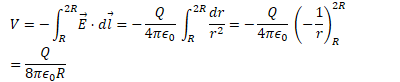
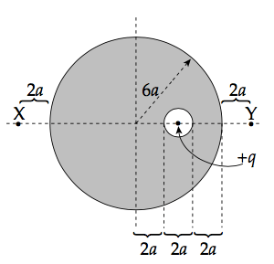
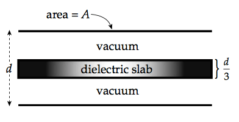
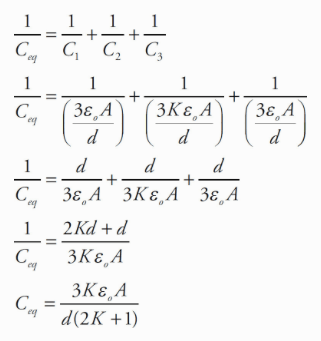

# Question 41

  -  N=m·kg·s-2

  -  J=m2·kg·s-2

  -  C=A·s

  -  V=m2·kg·s-3A-1

  -  T=kg·s-2A-1

# Question 48

  -  

 
 
 

# Question 53

  -  Parallel
         capacitors:
    
      -  

# Question 56

 

  -  Calculating Capacitance
    
    1.   Assume a charge of +Q and -Q on each conductor
    
    2.   Find the electric field between the conductors (Gauss's
             Law)
        
          -  
    
    3.   
        
          -  
    
    4.   
        
          -  

# Question 57

  -  Since the magnetic force is always perpendicular to the object’s
     velocity, it does zero work on any charged particle.

  -  Zero work means zero change in kinetic energy, so the speed
     remains the same.

  -  Remember: The magnetic force can only change the direction of a
     charged particle’s velocity, not its
 speed.

# Question 61

 
 
 ![If a conducting sphere contains a charge of + q within an inner
 cavity, a charge of —q will move to the wall of the cavity to "guard"
 the inte- rior of the sphere from an electrostatic field, regardless
 of the size, shape, or location of the cavity. As a result, a charge
 of +q is left on the exterior of the sphere (and it will be uniform).
 So, at points outside the sphere, the sphere behaves as if this charge
 + q were concentrated at its center, so the electric field outside is
 simply kQ/r . Since points X and Y are at the same distance from the
 center of the sphere, the elec- tric field strength at Y will be the
 same as at X. ](./media/image624.png)

# Question 66

 
 
 