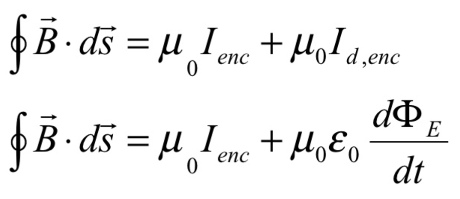

# Question 43

 

# Question 50

 
 
 

# Question 61

 
 
 

# Question 62

  -  Ampère-Maxwell’s Law -- A changing electric field would create a
     changing electric flux, which in turn would induce a magnetic
     field.

 

# Question 65

 ![A solid, metal object is isolated from other charges and has charge
 distributed on its surface. The charge distribution is not uniform. It
 may be correctly concluded that the (A) electric field outside the
 object is zero (B) the electric field outside the object is equal to
 the electric field inside the object (C) the electric field outside
 the object is directly proportional to the distance away from the
 center of mass of the object (D) the electric field outside the
 object, but very close to the surface, is equal to the surface charge
 density at any location divided by the permittivity of free space (E)
 the electric potential on the surface of the object is not constant
 ](./media/image633.png)
 
 ![For a solid, metal object the electric field inside is equal to
 zero. The electric field outside the object will not be zero because
 some excess charge is contained on the object and Gauss's Law can be
 applied to show that Qin would generate an electric field. This
 information eliminates (A) and (B). The surface of a conductor is an
 equipotential, so (E) is not cor- rect. The strength of the electric
 field should decrease as the distance away from the center increases,
 so (C) is not correct. (D) is correct, and we can apply Gauss's Law as
 shown below to the odd-shaped figure as indicated. The Qin will be
 equal to the surface charge density at the location times the area of
 the endcap of the Gaussian cylinder. This is only true very close to
 the surface of the object so that the Gaussian cylinder is
 perpendicular to the surface. ](./media/image634.png)
 
 

# Question 68

 
